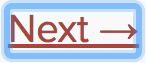

> 此文章是翻译[Accessibility](https://reactjs.org/docs/accessibility.html)这篇React（版本v16.2.0）官方文档。

## Accessibility

### Why Accessibility

Web 可访问性（也称为[a11y](https://en.wiktionary.org/wiki/a11y)）是设计和创建每个人都可以使用的网站。为了使辅助技术能够解释网页，可访问性支持是必要的。

React 完全支持建立可访问的网站，通常使用标准的HTML 技术。

### Standards and Guidelines

#### WCAG

[Web Content Accessibility Guidelines](https://www.w3.org/WAI/intro/wcag) 为建立可访问性网站提供指导。

下面WCAG 清单提供概述

* [WCAG checklist from Wuhcag](https://www.wuhcag.com/wcag-checklist/)
* [WCAG checklist from WebAIM](http://webaim.org/standards/wcag/checklist)
* [Checklist from The A11Y Project](http://a11yproject.com/checklist.html)

#### WAI-ARIA

[Web Accessibility Initiative - Accessible Rich Internet Application](https://www.w3.org/WAI/intro/aria) 文档包含构建全部可访问性JavaScript 工具的技术。

注意JSX 完全支持所有的`aria-*` HTML 特性。然而，在React 中大部分DOM 属性和特性采用camelCased，这些特性应该采用lowercased：

```
<input
  type="text"
  aria-label={labelText}
  aria-required="true"
  onChange={onChangeHandler}
  value={inputValue}
  name="name"
/>
```

### Semantic HTML

语义化 HTML是Web 应用程序可访问性的基础。使用各种HTML 元素来加强我们网站中信息的意义，通常会给我们自由的访问性。

* [MDN HTML 元素引用](https://developer.mozilla.org/en-US/docs/Web/HTML/Element)

有时，当我们将`<div>` 元素添加到JSX 以使我们的React 代码工作时，我们会破坏HTML 语义，特别是在处理列表（`<ol>`、`<ul>`和`<dl>`）和HTML `<table>` 时。在这种情况下，我们应该使用React Fragments 将多个元素组合在一起。

当需要`key` props时，请使用`<Fragment>`：

```
import React, { Fragment } from 'react';

function Glossary(props) {
  return (
    <dl>
      {props.items.map(item => (
        // Without the `key`, React will fire a key waring
        <Fragment key={item.id}>
          <dt>{item.term}</dt>
          <dd>{item.description}</dd>
        </Fragment>
      ))}
    </dl>
  );
}
```

在其他任何地方使用`<></>` 语法：

```
function ListItem({ item }) {
  return (
    <>
    <dt>{item.term}</dt>
    <dd>{item.description}</dd>
    </>
  )
}
```

### Accessible Forms

#### Labeling

每个HTML 表单控件，例如`<input>` 和`<textarea>`，需要被标记为可访问性。我们需要提供描述性标签同样也暴露于屏幕阅读器。

以下资源显示了如何执行此操作：

* [The W3C shows us how to label elements](https://www.w3.org/WAI/tutorials/forms/labels/)
* [WebAIM shows us how to label elements](http://webaim.org/techniques/forms/controls)
* [The Paciello Group explains accessible name](https://www.paciellogroup.com/blog/2017/04/what-is-an-accessible-name/)

尽管这些标准的HTML 实践可以直接用于React，需要注意在JSX中，`for`特性被写作`htmlFor`:

```
<label htmlFor="namedInput">Name:</label>
<input id="namedINput" type="text" name="name"/>
```

#### Notifying the user of errros

错误环境需要被所有用户理解。下列链接也说明了如何显示错误文本给屏幕阅读器：

* [The W3C demonstrates user notification](https://www.w3.org/WAI/tutorials/forms/notifications/)
* [WebAIM looks at form validation](http://webaim.org/techniques/formvalidation/)

### Focus Control

确保你的web 应用完全可以仅通过键盘来操作：

* [WebAIM talks about keyboard accessibility](http://webaim.org/techniques/keyboard/)

#### Keyboard focus and focus outline

键盘焦点是指DOM 中当前元素，该元素被选中以接受来自键盘的输入。我们把它看作是一个焦点框，类似于下面的图像：



仅能使用CSS 来移除这一边框，例如可以设置`outline: 0` ，如果你要用其他焦点框来替换他。

#### Mechanisms to skip to desired content

提供一种机制，允许用户跳过应用程序中的导航部分，这样可以帮助和加快键盘导航。

Skiplinks 或Skip Navigation Links 是隐藏的导航链接，仅对键盘用户与页面交互可见。它们很容易用内部页面锚和一些样式来实现：

* [WebAIM - Skip Navigation Links](http://webaim.org/techniques/skipnav/)

还可以使用里程碑元素和角色，如`<main>` 和`<aside>`，以划分页面区域，同时辅助技术允许用户快速导航到这些部分。

阅读更多关于这些元素的使用，以提高这里的可访问性：

* [Deque University - HTML 5 and ARIA Landmarks](https://dequeuniversity.com/assets/html/jquery-summit/html5/slides/landmarks.html)

#### Programmatically managing focus

我们的React 应用程序在运行时不断修改HTML DOM，有时导致键盘焦点丢失或设置为不被期待的元素。为了修复这个问题，我们需要以编程方式将键盘聚焦在正确的方向上。例如，在模态窗口关闭之后，将键盘焦点重置为打开模态窗口的按钮。

Mozilla Developer Network 考虑了这一点，并介绍了如何构建[keyboard-navigable JavaScript widgets](https://developer.mozilla.org/en-US/docs/Web/Accessibility/Keyboard-navigable_JavaScript_widgets)。

要在React 中设置焦点，我们可以使用[Refs to DOM elements](https://reactjs.org/docs/refs-and-the-dom.html)。

使用它，我们首先在组件类的JSX 中创建一个ref：

```
render() {
  // Use the `ref` callback to store a reference to the text input DOM
  // element in an instance field (for example, this.textInput).
  return (
    <input
      type="text"
      ref={(input) => { this.textInput = input; }}/>
  );
}
```

然后我们可以在需要时在组件中的其他地方设置焦点：

```
focus() {
  // Explicitly focus the text input useing the raw DOM API
}
```

有时父组件需要将焦点设置为子组件中的元素。虽然我们可以创建[refs to class components](https://reactjs.org/docs/refs-and-the-dom.html#adding-a-ref-to-a-class-component)，但我们需要一个与函数式组件一起工作的模式，当[using refs with HOCs](https://reactjs.org/docs/higher-order-components.html#refs-arent-passed-through)时。为确保我们的父组件始终能够访问ref，我们将回调作为一个prop 传递给子组件，以[将ref暴露给父组件](https://reactjs.org/docs/refs-and-the-dom.html#exposing-dom-refs-to-parent-components)。

```
// Expose the ref with a callback prop
function Field({ inputRef, ...rest }) {
  return <input ref={inputRef} {...rest} />;
}

// Inside a parent class component's render method...
<Field
  inputRef={(input) => {
    // This callback gets passed through as a regular prop
    this.inputEl = inputEl
  }}
/>

// Now you can set focus when requied.
this.inputEl.focus();
```

一个很好的焦点管理的例子是[react-aria-modal](https://github.com/davidtheclark/react-aria-modal)。这是一个相对罕见的完全可访问的模态窗口的例子。它不仅将初始焦点设置在取消按钮上(防止键盘用户意外激活成功操作)并将键盘焦点设置在模态内，而且还将焦点重置回最初触发该模态的元素。

>**注意；**

>虽然这是一个非常重要的可访问性特性，但它也是一种应该谨慎使用的技术。当键盘焦点流被干扰时，使用它来修复键盘焦点流，而不是试图预测用户希望如何使用应用程序。

### More Complex Widgets

更复杂的用户体验不应意味着缺少可访问性的用户体验。虽然可访问性最容易通过尽可能接近HTML 的编码来实现，即使最复杂的小部件也可以编码实现可访问性。

这里我们需要了解[ARIA Roles](https://www.w3.org/TR/wai-aria/roles)以及[ARIA States and Properties](https://www.w3.org/TR/wai-aria/states_and_properties)。这些工具箱被在JSX 中完全支持的HTML 特性填充的，能使我们构建完全可访问的、高功能的React 组件。

每个类型的小部件都具有特定的设计模式，并且期望由用户和用户代理以某种方式起作用：

* [WAI-ARIA Authoring Practices - Design Patterns and Widgets](https://www.w3.org/TR/wai-aria-practices/#aria_ex)
* [Heydon Pickering - ARIA Example](http://heydonworks.com/practical_aria_examples/)
* [Inclusive Components](https://inclusive-components.design/)

### Other Points for Consideration

#### Setting the language

指示页面文本的人类语言作为屏幕阅读器软件中使用，来选择正确的声音设置：

* [WebAIM - Document Language](http://webaim.org/techniques/screenreader/#language)

#### Setting the document title

设置文档`<title>` 以便正确描述当前页面内容，因为这确保了用户仍然知道当前页面上下文：

* [WCAG - Understanding the Document Title Requirement](https://www.w3.org/TR/UNDERSTANDING-WCAG20/navigation-mechanisms-title.html

在React 中，我们使用[React Document Title Component](https://github.com/gaearon/react-document-title) 设置它。

#### Color contrast

确保网站上所有可读的文本都有足够的颜色对比，以保持低视力用户的最大可读性：

* [WCAG - Understanding the Color Contrast Requirement](https://www.w3.org/TR/UNDERSTANDING-WCAG20/visual-audio-contrast-contrast.html)
* [Everything About Color Contrast And Why You Should Rethink it](https://www.smashingmagazine.com/2014/10/color-contrast-tips-and-tools-for-accessibility/)
* [A11yProject - What is Color Contrast](http://a11yproject.com/posts/what-is-color-contrast/)

可能会很乏味去手动计算网站中所有情况下的适当颜色组合，因此，你可以[calculate an entire accessible color palette with Colorable](http://jxnblk.com/colorable/)

下面提到的aXe 和WAVE 工具也包括颜色对比测试，并将报告对比错误。

如果你要扩展对比度测试能力，你可以使用以下工具：

* [WebAIM - Color Contrast Checker](http://webaim.org/resources/contrastchecker/)
* [The Paciello Group - Color Contrast Analyzer](https://www.paciellogroup.com/resources/contrastanalyser/)

### Development and Testing Tools

我们可以使用许多工具来帮助创建可访问的Web 应用程序。

#### The keyboard

到目前为止，最简单也是最重要的检查之一是测试你的整个网站是否可以到达并单独使用键盘。这样做的方法是：

1. 拔下你的鼠标。
2. 使用`Tab` 和`Shift+Tab` 浏览。
3. 使用`Enter`键激活元素。
4. 如果需要，使用键盘箭头键与某些元素进行交互，如菜单和下拉菜单。

#### Development assistance

我们可以在JSX 代码里直接查看一些可访问性特性。通常在一些识别JSX 的IDE 已经提供了为ARIA roles，states 和properties 的智能检查。我们也可采用如下工具：

**eslint-plugin-jsx-a11y**

基于ESLint 的[eslint-plugin-jsx-a11y](https://github.com/evcohen/eslint-plugin-jsx-a11y) 插件提供了在JSX 中关于可访问性问题的AST 检查反馈。大部分IDE 允许你集成这些发现，直接在代码分析和源码窗口中。

[Create React App](https://github.com/facebookincubator/create-react-app) 包含了带有部分激活规则的这一插件。若想要支持更多的可访问性规则，你可以在项目的根目录下创建一个`.eslintrc` 文件并包含如下内容：

```
{
  "extends": ["react-app", "plugin:jsx-ally/recommended"],
  "plugins": ["jsx-a11y"]
}
```

#### Testing accessibility in the browser

在浏览器里已有大量工具能够在页面上运行可访问性审计。可以结合之前提到过的其他可访问性检查工具来使用他们，因为他们仅可以测试HTML 中技术上的可访问性。

**aXe, aXe-core and react-axe**

Deque System 为应用提供了自动化和端到端的可访问性测试[aXe-core](https://www.deque.com/products/axe-core/) 。这一模块包含了Selenium 的集成。

[可访问性Engine](https://www.deque.com/products/axe/) 或 aXe，是一款基于`aXe-core` 构建的可访问性检测器的浏览器插件。

你也可以在开发和调试环节，使用[react-axe](https://github.com/dylanb/react-axe) 模块在控制台中直接报告可访问性问题。

**WebAIM WAVE**

[Web Accessibility Evaluation Tool](http://wave.webaim.org/extension/) 是另一个可访问性的浏览器插件。


**Accessibility inspectors and the Accessibility Tree**

[The Accessibility Tree](https://www.paciellogroup.com/blog/2015/01/the-browser-accessibility-tree/) 是一个DOM 树的子集，其包含每个DOM 元素的可访问性对象，其应暴露给辅助性技术，如屏幕阅读器等。

在一些浏览器我们可以在可访问树中轻松地访问每个元素的可访问性信息：

* [Activate the Accessibility Inspector in Chrome](https://gist.github.com/marcysutton/0a42f815878c159517a55e6652e3b23a)
* [Using the Accessibility Inspector in OS X Safari](https://developer.apple.com/library/content/documentation/Accessibility/Conceptual/AccessibilityMacOSX/OSXAXTestingApps.html)

#### Screen readers

结合屏幕阅读器进行测试应构成可访问性测试的一部分。

注意浏览器 / 屏幕阅读器的结合重要性。建议在浏览器中选择最适合的屏幕阅读器测试应用程序。

**NVDA in Firefox**

[NonVisual Desktop Access](https://www.nvaccess.org/) 或NVDA 是一款广泛使用的开源的窗口屏幕阅读器.

关于如何更好使用NVDA 参考如下指南:

* [WebAIM - Using NVDA to Evaluate Web Accessibility](http://webaim.org/articles/nvda/)
* [Deque - NVDA Keyboard Shortcuts](https://dequeuniversity.com/screenreaders/nvda-keyboard-shortcuts)

**VoiceOver in Safari**

VoiceOver 是一个集成在苹果设备的屏幕阅读器。

参考以下指南了解关于如何触发和使用VoiceOver：

* [WebAIM - Using VoiceOver to Evaluate Web Accessibility](http://webaim.org/articles/voiceover/)
* [Deque - VoiceOver for OS X Keyboard Shortcuts](https://dequeuniversity.com/screenreaders/voiceover-keyboard-shortcuts)
* [Deque - VoiceOver for iOS Shortcuts](https://dequeuniversity.com/screenreaders/voiceover-ios-shortcuts)

**JAWS in Internet Explorer**

[Job Access With Speech](http://www.freedomscientific.com/Products/Blindness/JAWS) 或JAWS，是一款在Windows 广泛使用的屏幕阅读器。

关于更好使用JAWS 参考如下指南：

* [WebAIM - Using JAWS to Evaluate Web Accessibility](http://webaim.org/articles/jaws/)
* [Deque - JAWS Keyboard Shortcuts](https://dequeuniversity.com/screenreaders/jaws-keyboard-shortcuts)
