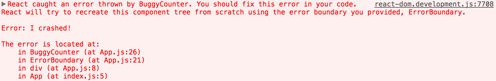

> 此文章是翻译[Error Boundaries](https://reactjs.org/docs/error-boundaries.html)这篇React（版本v16.2.0）官方文档。

## Error Boundaries

过去，组件内的JavaScript 错误会破获React 的内部state，并导致它在下一个渲染时[发出](https://github.com/facebook/react/issues/4026)[隐藏](https://github.com/facebook/react/issues/6895)[错误](https://github.com/facebook/react/issues/8579)。这些错误总是由应用程序代码中的早期错误引起的，但是React 并没有提供一种在组件中优雅地处理它们的方法，并且无法从它们中恢复。

### Introducing Error Boundaries

部分UI 的JavaScript 错误不应该破坏整个应用。为了解决React 用户的这一问题，React 16 引入了一种称为 “错误边界（error boundary）” 的新概念。

错误边界是React 组件，**能捕获其子组件树任何位置的JavaScript 错误，记录错误并展示一个回退的UI**，而不是整个组件树的崩溃。错误组件在渲染期间，生命周期方法内，以及整个组件树构造函数内捕获错误。

>**注意**

>错误边界无法捕获如下错误

>* 事件处理 （[了解更多](https://reactjs.org/docs/error-boundaries.html#how-about-event-handlers)）
>* 异步代码 （例如，`setTimeout` 或`requestAnimationFrame` 回调函数）
>* 服务端渲染
>* 错误边界自身抛出来的错误 （而不是其子组件）

如果一个类组件成为一个错误边界，如果它定义了一个名为`componentDidCatch(error, info)` 的新方法：

```
class ErrorBoundary extends React.Component {
  constructor(props) {
    super(props);
    this.state = { hasError: false };
  }

  componentDidCatch(error, info) {
    // Display fallback UI
    this.setState({ hasError: true });
    // You can also log the error to an error reporting service
    logErrorToMyService(error, info);
  }

  render() {
    if (this.state.hasError) {
      // You can render any custom fallback UI
      return <h1>Something went wrong.</h1>;
    }
    return this.props.children;
  }
}
```

而后你可以像一个普通的组件一样使用：

```
<ErrorBoundary>
  <MyWidget />
</ErrorBoundary>
```

`componentdidcatch()` 方法使用就像一个JavaScript `catch {}` 块，但是针对组件。只有类组件可以成为错误边界。实际上，大多数情况下你希望声明一次错误边界组件，并在整个应用程序中使用它。

注意，**错误边界只捕获组件树下面的组件中的错误**。错误边界不能捕获自身内部的错误。如果错误边界不能渲染错误消息，则错误将传播到上面的最接近错误边界。这也类似于JavaScript 中catch {} 块的工作。

#### componentDidCatch Parameters

`error` 是被抛出的错误。

`info` 是一个有`componentStack` key 的对象。这个属性有在抛出错误时关于组件栈的信息。

```
// ...
componentDidCatch(error, info) {

  /* Example stack information:
    in ComponentThatThrows (created by App)
    in ErrorBoundary (created by App)
    in div (created by App)
    in App
  */
  logComponentStackToMyService(info.componentStack);
}
// ...
```

### Live Demo

查看使用[React 16 beta](https://github.com/facebook/react/issues/10294) 的[声明和使用错误边界的例子](https://codepen.io/gaearon/pen/wqvxGa?editors=0010)

### Where to Place Error Boundaries

错误边界的粒度取决于你。你可以将其包装在最顶层的路由组件并为用户展示一个“发生异常（Something went wrong）“的错误信息，就像服务端框架通常处理崩溃一样。你也可以将单独的插件包装在错误边界内部以保护应用不受该组件崩溃的影响。

### New Behavior for Uncaught Errors

这一更改具有重要的含义。**从React 16开始，没有被任何错误边界捕获的错误将导致卸载整个React 组件树。**

我们仔细讨论了这个决定，但根据我们的经验，保留崩溃的UI 比完全删除它更糟糕。例如，在像Messenger 这样的产品中，保留已崩溃的UI 可见可能会导致有人向错误的人发送消息。同样，如果支付应用程序显示错误的金额，比不显示任何内容更糟糕。

这一更改意味着，你您迁移到React 16 时，你可能会发现应用程序中以前没有注意到的现有崩溃。添加错误边界可以让你在出错时提供更好的用户体验。

例如，Facebook Messenger 将侧边栏、信息面板、会话日志和消息输入的内容包装在单独的错误边界。如果这些UI区域中的某个组件崩溃，其余组件仍将保持交互。

我们还鼓励你使用JS 错误报告服务(或构建你自己的服务)，以便你能够了解在生产中发生的未处理异常，并修复它们。

### Component Stack Traces

在开发时，React 16打印所有在渲染时发生的所有错误到控制台，即使应用程序意外地将它们覆盖了。除了错误消息和JavaScript 堆栈之外，它还提供组件堆栈跟踪。现在你可以看到错付发生在组件树的什么位置：


你也可以在组件堆栈追踪中看到文件名和行数。这在[Create React App](https://github.com/facebookincubator/create-react-app) 中是默认工作的：


如果你不使用Create React App，你可以手动添加[这个插件](https://www.npmjs.com/package/babel-plugin-transform-react-jsx-source) 到Babel 配置文件中。请注意，它只用于开发，**必须在生产中禁用**。

>注意：

>堆栈跟踪中组件名称的展示取决于[Function.name](https://developer.mozilla.org/en-US/docs/Web/JavaScript/Reference/Global_Objects/Function/name)属性。如果你支持可能尚未本地提供此功能的旧浏览器和设备(例如IE 11)，请考虑在打包的应用程序中包括一个[Function.name-polyfill](https://developer.mozilla.org/en-US/docs/Web/JavaScript/Reference/Global_Objects/Function/name)，例如函数名-poly填充。或者，你可以显式地在所有组件上设置[displayName](https://reactjs.org/docs/react-component.html#displayname)属性。

### How About try/catch?

`try` / `catch` 更好，但它只工作在命令式代码：

```
try {
  showButton();
} catch (error) {
  // ...
}
```

然而，React 组件是声明式并且明确指出什么应该被渲染：

```
<Button />
```

错误边界保留了React 原生的声明性质，且其行为符合你的预期。例如，即使错误发生 `componentDidUpdate` 狗仔，时期由某一个深层中的`setState` 调用引起，其仍然能够冒泡到最近的错误边界。

### How About Event Handlers?

错误边界不捕获事件处理器中的错误。

React 不需要错误边界在事件处理器内将其从错误中恢复。不像渲染方法或生命周期钩子，事件处理器不会在渲染周期内触发。因此若他们抛出异常，React 仍然能够知道需要在屏幕上显示什么。

如果你需要在事件处理器内部捕获错误，使用普通的 JavaScript `try` / `catch` 语句：

```
class MyComponent extends React.Component {
  constructor(props) {
    super(props);
    this.state = { error: null };
  }

  handleClick = () => {
    try {
      // Do something that could throw
    } catch (error) {
      this.setState({ error });
    }
  }

  render() {
    if (this.state.error) {
      return <h1>Caught an error.</h1>
    }
    return <div onClick={this.handleClick}>Click Me</div>
  }
}
```

请注意，上面的示例演示了常规的JavaScript 行为，并且不使用错误边界。

### Naming Chagnes from React 15

React 15 在一个不同命的方法名：`unstable_handleerror` 中包非常有限的错误边界支持。这个方法不再工作，你将需要改变它为`componentdidcatch` 在你的代码开始，从第一个16 beta 版本。

对于这种变化，我们提供了一个[codemod](https://github.com/reactjs/react-codemod#error-boundaries) 去自动迁移你的代码。
