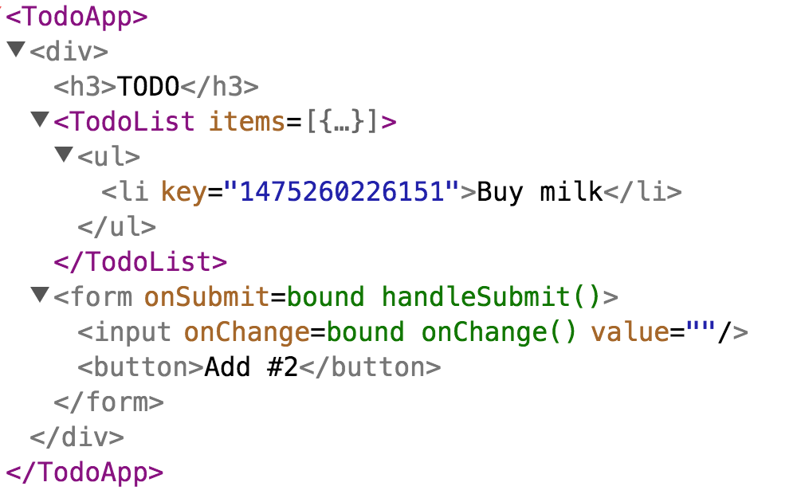

> 此文章是翻译[Implementation Notes](https://facebook.github.io/react/contributing/implementation-notes.html)这篇React（版本v15.4.0）官方文档。

## Implementation Notes

这部分是[stack reconciler](https://facebook.github.io/react/contributing/codebase-overview.html#stack-reconciler) 实现笔记集合。

这是非常技术性的，并且呈现对React 公共API 的强烈理解，以及如何划分为核心（core），渲染器（renderer）以及reconciler。如果你对React 代码库不是非常了解，首先阅读[the codebase overview](https://facebook.github.io/react/contributing/codebase-overview.html)。

目前stack reconciler 是所有React 生产代码中最有效的。它位于[src/renderers/shared/stack/reconciler](https://github.com/facebook/react/tree/master/src/renderers/shared/stack) 并且被React DOM 和React Native 使用。

### Video: Buiding React from Scratch

[Paul O'Shannessy](https://twitter.com/zpao) 关于[builing React form scratch](https://www.youtube.com/watch?v=_MAD4Oly9yg) 的演讲，大大的启发了这篇文档。

这篇文档和他的演讲是实际代码的简化，所以你可以更好的了解通过熟悉这两者。

### Overview

reconciler 自身没有一个公共的API。[Renderers](https://facebook.github.io/react/contributing/codebase-overview.html#stack-renderers) 像React DOM 和React Native使用它去有效地更新用户界面（user interface）根据用户写的React component。

### Mounting as a Recursive Process

让我们考虑首次加载一个component：
```jsx
ReactDOM.render(<App />, rootEl)
```
React DOM 将`<App />` 传入reconciler。记住`<App />` 是一个React element，也就是一个渲染成什么样的描述。你可以把它想象成一个普通的对象：
```jsx
console.log(<App />)
// {type: App, props: {}}
```
reconciler 将检查`App` 是一个类（class）还是一个函数（function）。

如果`App` 是一个函数，reconciler 将调用`App(props)` 去得到这个已渲染的element。

如果`App` 是一个类，reconciler 通过`new App(props)` 实例化一个`App`，调用`componentWillMount` 声明周期方法，然后调用`render()` 方法去获取这个已渲染的element。

无论那种方式，reconciler 将会了解`App` element “渲染成（rendered to）”。

这个过程是递归的（recursive），`App` 可能渲染成一个`<Greeting />`，`Greeting` 可能去渲染成一个`<Button />`，等等。reconciler 将会递归地“向下获取数据（drill down）”通过用户定义的component ，当它了解每一个component 渲染成什么。

你可以将这一过程想象成一段伪代码。
```jsx
// This function takes a React element (e.g. <App />)
// and returns a DOM or Native node representing the mounted tree.
function mount(element){
  var type = element.type
  var props = element.props

  // We will determine the rendered element
  // by either running the type as function
  // or creating an instance and calling render()
  var renderedElement
  if(isClass(type)){
    // Common class
    var publicInstance = new type(props)
    // Set the props
    publicInstance.props = props
    // Call the lifecycle if necessary
    if(publicInstance.componentWillMount){
      publicInstance.componentWillMount()
    }
    // Get the rendered element by calling render()
    renderedElement = publicInstance.render()
  }else{
    // Component function
    renderedElement = type(props)
  }

  // This process is recursive because a component may
  // return an element with a type of another component
  return mount(renderedElement)

  // Note: this implementation is incomplete and recurses infinitely!
  // It only handles elements like <App /> or <Button />.
  // It doesn't handle elments like <div /> or <p /> yet.
}

var rootEl = document.getElementById('root')
var node = mount(<App />)
rootEl.appendChild(node)
```

>**Note：**
这真的是伪代码。它不同于真正的是实现。它将会导致一个栈溢出（stack overflow）因为我们还没有讨论什么时候去停止这个递归（recursion）。

让我们概括上述例子中的几个关键思路：

* React elements 是普通对象表示component 类型（例如：`App`）和props。
* 用户定义的component（例如：`App`）可以是类或函数，但是它们都“渲染成（render to）”elements。
* “加载（mounting）”是一个递归进程（recursive process），通过给定顶级React element（例如`<App />`）创建DOM 或Native 树。

### Mounting Host Elements

这个过程将会是无效的，如果我们不渲染一些东西到屏幕上作为结果。

除了用户定义的（“composite”）components，React element 也可以表示平台特定的（“host”）components。例如，`Button` 可能返回一个`<div />` 从它的渲染方法中。

如果element 的`type` 属性是一个字符串，我们处理成一个host element 。
```jsx
console.log(<div />)
//  {type: 'div', props: {}}
```
没有用户定义的代码同host elements 相关联。

当reconciler 遇到一个host element，它让渲染器去处理加载它。例如，React DOM 将会创建一个DOM 节点。

如果host element 有子节点，reconciler 将会根据上述的相同的算法递归加载它们。它不关心孩子节点是host（像`<div><hr /></div>`）,还是composite（像`<div><Button /></div>`），或者两者都是。

被孩子component生成的DOM 节点，将会追加到父DOM 节点，并且递归地，完成的DOM 结构将会被组装。

>**Note：**
reconciler 自身不会绑定到DOM。加载的（有时，在源代码中称为“mount image”）最准确结果依赖渲染器，并且它亦是一个DOM 节点（React DOM），字符串（React DOM Server），或者是一个数字代表本地视图（React Native）。

如果我们扩展代码去处理host element，它将看上去像这样：
```jsx
function isClass(type){
  // React.Component subclasses have this flag
  return (
    Boolean(type.prototype) &&
    Boolean(type.prototype.isReactComponent)
  )
}

// This function only hanles elements with a composite type.
// For example, it handles <App /> and <Button />, but not a <div />.
function mountComposite(element){
  var type = element.type
  var props = element.props

  var renderedElement
  if(isClass(type)){
    // Component class
    var publicInstance = new type(props)
    // Set the props
    publicInstance.props = props
    // Call the lifecycle if necessay
    if(publicInstance.componentWillMount){
      publicInstance.componentWillMount()
    }
    renderedElement = publicInstance.render()
  }else if(typeof type === 'function'){
    // Component function
    renderedElement = type(props)
  }

  // This is recursive but we'll eventually reach the bottom of recursion when
  // the element is host <e.g. <div />) rather than composite (e.g. <App />);
  return mount(renderedElement)
}

// This function only handles elements with a host type.
// For example, it handles <div /> and <p /> but not an <App />.
function mountHost(element){
  var type = element.type
  var props = element.props
  var children = props.children || []
  if(!Array.isArray(children)){
    children = [children]
  }
  children = children.fiter(Boolean)

  // This block of code shouldn't be in the reconciler.
  // Different renderers might initialize nodes differently.
  // For example, React Native would create iOS or Android views.
  var node = document.createElement(type)
  Object.keys(props).forEach(propName => {
    if(propName !== children){
      node.setAttribute(propName, props[propName])
    }
  })

  // Mount the children
  children.forEach(childElement => {
    // Children may be host (e.g. <div />) or composite (e.g. <Button />).
    // We will also mount them recursively:
    var childNode = mount(childElement)

    // This line of code is alse renderer-specific.
    // It would be different depending on the renderer:
    node.appendChild(childNode)
  })

  // Return the DOM node as mount result.
  // This is where the recursion ends.
  return node
}

function mount(element){
  var type = element.type
  if(typeof type === 'function'){
    // User-defined components
    return mountComposite(element)
  }else if( typeof type === 'string'){
    // Platform-specific components
    return mountHost(element)
  }
}

var rootEl = document.getElementById('root')
var node = mount(<App />)
rootEl.appendChild(node)
```
这是工作的，但是它仍然同reconciler 真正实现有相当远的距离。缺少关键的成分去支持更新。

### Introducing Internal Instances

React 关键的特性是你可以重新渲染任何事情，并且它不会重新创建DOM 或者是重置state：
```jsx
ReactDOM.render(<App />, rootEl)
// Should reuse the existing DOM
ReactDOM.render(<App />, rootEl)

```
然而，我们上述的实现仅知道如何去加载初始化树。在它上面不能执行更新因为它不存储任何必须要的信息，像所有的`pulicInstance`，或哪一个DOM `node` 对于哪一个component。

stack reconciler 代码库解决它通过制作`mount()` 函数方法并将其放到它的类上。这种方法有缺点，我们将在相反的方法[继续重新reconciler（ongoing rewrite of the reconciler）](https://facebook.github.io/react/contributing/codebase-overview.html#fiber-reconciler)。然而，现在它就是这样工作的。

而不是分离`mountHost` 和`mountComposite` 函数，我们将要创建两个类：`DOMComponent` 和`CompositeComponent`。

这两个类都有一个接受`element` 的构造函数，除了一个返回已加载节点的`mount()` 方法之外。我们将使用工厂正确实例化类来替代顶级`mount` 方法：
```jsx
function instantiateComponent(element){
  var type = element.type
  if(typeof type === 'function'){
    // User-defined components
    return new CompositeComponent(element)
  }else if( typeof type === 'string'){
    // Platform-specific components
    return new DOMComponent(element)
  }
}
```
首先，让我们考虑`CompositeComponent` 的实现：
```jsx
class CompositeComponent {
  constructor(element){
    this.currentElement = element
    this.renderedElement = null
    this.publicInstance = null
  }

  getPublicInstance(){
    // For composite components, expose the class instance
    return this.publicInstance
  }

  mount(){
    var element = this.currentElement
    var type = element.type
    var props = element.props

    var publicInstance
    var renderedElement
    if(isClass(type)){
      // Component class
      publicInstance = new type(props)
      // Set the props
      publicInstance.props = props
      // Call the lifecycle if necessary
      if(publicInstance.componentWillMount){
        publicInstance.componentWillMount()
      }
      renderedElement = publicInstance.render()
    }else if(typeof type === 'function'){
      // Component function
      publicInstance = null
      renderedElement = type(props)
    }

    // Save the public instance
    this.publicInstance = publicInstance

    // Instantiate the child internal instance according to the element.
    // It would be a DOMComponent for <div /> or <p />
    // and a CompositeComponent for <App /> or <Button />:
    var renderedComponent = instantiateComponent(renderedElement)
    this.renderedComponent = renderedComponent

    // Mount the rendered output
    return renderedComponent.mount()
  }
}
```
这和我们之前的`mountComposite()` 实现并没有什么大的不同，但是，现在我们可以保存一些信息，例如`this.currentElement`，`this.renderedComponent` 以及各`this.publicInstance` ，为了更新时使用。

注意`CompositeComponent` 的实例同用户提供的`element.type` 不是同一样东西。`CompositeComponent` 是我们的reconciler 实现细节，并且绝不会暴露给用户。用户提供的类是我们从`element.type` 读取的，并且`CompositeComponent` 创建它的一个实例。

为了避免产生困惑，我们称`CompositeComponent` 和`DOMComponent` 的实例为“内部实例（internal instances ）”。它们存在所有我们可以将一些长期存在的数据同它们联系。只有渲染器和reconciler 意识到它们的存在。

相反，我们称用户定义的类的实例为“公共实例（public instance）”。公共实例是你在`render()` 方法以及其它自定义component 方法中看到的`this`。

`mountHost()` 函数重构为`DOMComponent` 类上的`mount()` 方法，看上去像：
```jsx
class DOMComponent {
  constructor(element){
    this.currentElement = element
    this.renderedChildren = []
    this.node = null
  }

  getPublicInstance(){
    // For DOM components, only expose the DOM node.
    return this.node
  }

  mount(){
    var element = this.currentElement
    var type = element.type
    var props = element.props
    var children = props.children || []
    if(!Array.isArray(children)){
      children = [children]
    }

    // Create and save the node
    var node = document.createElement(type)
    this.node = node


    // Set the attributes
    Object.keys(props).forEach(propName => {
      if (propName !== 'children'){
        node.setAttribute(propName, props[propName])
      }
    })

    // Create and save the contained children.
    // Each of them can be a DOMComponent or a CompositeComponent,
    // depending on whether the element type is a string or a function.
    var renderedChildren = children.map(instantiateComponent)
    this.renderedChildren = renderedChildren

    // Collect DOM nodes they return on mount
    var childNodes = renderedChildren.map(child => childmount)
    childNodes.forEach(childNode => node.appendChild(childNode))

    // Return the DOM node as mount result
    return node
  }
}
```
`mountHost()` 重构后最大的不同是，现在我们保存`this.node` 和`this.renderedChildren` 到内部DOM component 实例上。未来我们将要将其应用到非破坏性（non-destructive）更新上。

因此，每个内部实例，composite 或者host ，现在都指向它们孩子的内部实例。为了更好的理解它，如果一个函数`<App>` component 渲染一个`<Button>` 类component，并且`Button` 类渲染一个`<div>`，这个内部实例树看上去像这样：
```jsx
[object CompositeComponent]{
  currentElement: <App />,
  publicInstance: null,
  renderedComponent: [object CompositeComponent]{
    currentElement: <Button />,
    publicInstance: [object Button],
    renderedComponent: [object DOMComponent]{
      currentElement: <div />,
      node: [object HTMLDivElement],
      renderedChildren: []
     }
  }
}
```
在DOM中你将只能看到`<div>`。然而内部实例树包括composite 和host 内部实例。

composite 内部实例需要存储：

* 当前element。
* 公共实例，如果element 类型是class。
* 单个已经渲染的内部实例。它可以是`DOMComponent` 或者`CompositeComponent`。

host 内部实例需要存储：

* 当前element。
* DOM 节点。
* 所有的孩子颞部实例。它们中的每一个可以是`DOMComponent` 或`CompositeComponent`。

如果你很难想象在复杂应用中内部实例树的结构，[React DevTools](https://github.com/facebook/react-devtools) 可以给你一个非常近似的，因为它使用灰色高亮host 实例，使用紫色高亮composite 实例：



为了完成重构，我们将要引入一个函数来加载一个完整的树到容器节点中，就像`ReactDOM.render()` 。它像`ReactDOM.render()` 返回一个公共实例：
```jsx
function mountTree(element, containerNode){
  // Create the top-level internal instance
  var rootComponent = instantiateComponent(element)

  // Mount the top-level component into the container
  var node = rootComponent.mount()
  containerNode.appendChild(node)

  // Return the public instance it provides
  var publicInstance = rootComponent.getPublicInstance()
  return publicInstance
}

var rootEl = document.getElementById('root')
mountTree(<App />, rootEl)
```

### Unmounting

现在我们有内部实例保存它们的孩子和DOM 节点，我们可以实现卸载（unmounting）。对于一个composite component，卸载递归地调用生命周期钩子。
```jsx
class CompositeComponent{

  //...

  unmount(){
    // Call the lifecycle hook if necessary
    var publicInstance = this.publicInstance
    if(publicInstance){
      if(publicInstance.componentWillUnmount){
        publicInstance.componentWillUnmount()
      }
    }

    // Unmount the single rendered component
    var renderedComponent = this.renderedComponent
    renderedComponent.unmount()
  }
}
```
对于`DOMComponent`，卸载告诉每一个孩子去卸载：
```jsx
class DOMComponent{

  // ...

  unmount(){
    // Unmount all the children
    var renderedChildren = this.renderedChildren
    renderedChildren.forEach(child => child.unmount())
  }
}
```
实际上，卸载DOM component 也会移除事件侦听器以及清理一些缓存，但是我们将跳过这些细节。

我们现在可以添加一个`unmountTree(containerNode)` 的顶级函数，它同`ReactDOM.unmountComponentAtNode()` 非常相似：
```jsx
function unmountTree(containerNode){
  // Read the internal instance from a DOM node
  // (This doesn't work yet, we will need to change mountTree() to store it.)
  var node = containerNode.firstChild
  var rootComponent = node._internalInstance

  // Unmount the tree and clear the container
  rootComponent.unmount()
  containerNode.innerHTML = ''
}
```
为了让这能够工作，我们需要从DOM 节点中读取一个内部根实例。我们将修改`mountTree()` 方法，添加`_internalInstance` 属性到根DOM
节点。我们将教导`mountTree` 去销毁任何已经组成呢的树，所以它可以被多次调用：
```jsx
function mountTree(element, containerNode){
  // Destory any existing tree
  if(containerNode.firstChild){
    unmountTree(containerNode)
  }

  // Create the top-level internal instance
  var rootComponent = instantiateComponent(element)

  // Mount the top-level component into the container
  var node = rootComponent.mount()
  containerNode.appendChild(node)

  // Return the public instance it provides
  var publicInstance = rootComponent.getPublicInstance()
  return publicInstance
}
```
现在，运行`unmountTree()` ，或重复运行`mountTree()`，移除旧的树并且在component 运行`componentWillUnmount` 这个生命周期钩子。

### Updating

在前面的章节，我们实现了卸载。然而React 将不会非常有用如果整个树中的每一个prop 都卸载然后加载。reconciler 的目标是复用已经存在实例，尽可能的保存DOM 和state。
```jsx
var rootEl = document.getElementById('root')

mountTree(<App />, rootEl)
// Should reuse the existing DOM
mountTree(<App />, rootEl)
```
我们将扩展我们的内部实例同一个或多个方法的联系。除了`mount()` 和`unmount()`，`DOMComponent` 和`CompositeComponent` 将会实现一个`receive(nextElement)` 新方法：
```jsx
class CompositeComponent{
  // ...

  receive(nextElement){
    // ...
  }
}

class DOMComponent{
  // ...

  receive(nextElement){
    // ...
  }
}
```
它的工作是通过由`nextElement` 提供的描述更新component（和它的任意子节点）。

这部分经常被描述为“虚拟DOM比较（virtual DOM diffing）”，虽然真正发生的是，我们递归内部树，并且让每一个内部实例收到更新。

### Updating Composite Components

当composite component 收到一个新的element 时，我们运行`componentWillUpdate()` 生命周期钩子。

然后我们重新渲染component 使用新的props，并且得到下一个已经渲染的element：
```jsx
class CompositeComponent{

  // ...

  receive(nextElement){
    var prevProps = this.currentElement.props
    var publicInstance = this.publicInstance
    var prevRenderedComponent = this.renderedComponent
    var prevRenderedElement = prevRenderedComponent.currentElement

    // Update *own* element
    this.currentElement = nextElement
    var type = nextElement.type
    var nextProps = nextElement.props

    // Figure out what the next render() output is
    var nextRenderedElement
    if(isClass(type)){
      // Component class
      // Call the lifecycle if necessary
      if(publicInstance.componentWillUpdate){
        publicInstance.componentWillUpdate(nextProps)
      }
      // Update the props
      publicInstance.props = nextProps
      // Re-render
      nextRenderedElement = publicInstance.render()
    }else if(typeof type === 'function'){
      // Component function
      nextRenderedElement = type(nextProps)
    }

    // ...
```
接下来，我们可以查看已渲染element 的`type`。如果`type` 还没有改变自从上一次渲染，上面的component 可以在这个位置更新。

例如，如果首次它返回`<Button color="red" />`，第二次返回`<Button color="blue" />`，我们就可以告诉响应的内部实例去`recevie()` 下一个element：
```jsx
    // ...

    // If the rendered element type has not change,
    // reuse the existing component instance and exit.
    if(prevRenderedElement.type === nextRenderedElement.type){
      prevRenderedComponent.receive(nextRenderedElement)
      return
    }

    // ...
```
然而，如果接下来已渲染的element 同上一个已渲染的element 有不同的`type`，我们不能更新这个内部实例。例如，上一次渲染成`<button />` 的component 渲染成`<input />` 发生时：
```jsx
    // ...

    // If we reached this point, we need to unmount the previously
    // mounted component, mount the new one, and swap their nodes.

    // Find the old node because it will need to be replaced
    var prevNode = prevRenderedComponent.getHostNode()

    // Unmount the old child and mount a new child
    prevRenderedComponent.unmount()
    var nextRenderedComponent = instantiateComponent(nextRenderedElement)
    var nextNode = nextRenderedComponent.mount()

    // Replace the reference to the child
    this.renderedComponent = nextRenderedComponent

    // Replace the old node with the new one
    // Note: this is renderer-specific code and
    // ideally should live outside of CompositeComponent
    prevNode.parentNode.replaceChild(nextNode, prevNode)
  }
}
```

总结，当composite component 收到一个新的element，它可以要么代理这个更新到它自己已经渲染的内部实例上，要么卸载它并且在它的位置重新加载一个新的。

还有另外一种情况下，当component 将要重新加载而不是接受一个新的element，那就是当element 的`key` 发生改变了。在文档中我们不讨论`key` 控制的情况，因为它对于一个已经复杂的说明书变得更加复杂。

注意我们需要添加一个名叫`getHostNode()` 的方法到内部实例上的契约，以至于可以定位平台特定的节点，在更新时用于替代它。它的实现对于两个类是直接的：
```jsx
class CompositeComponent{
  // ...

  getHostNode(){
    // Ask the rendered component to provide it.
    // This will recursively drill down any any composites.
    return this.renderedComponent.getHostNode()
  }
}

class DOMComponent{
  // ...

  getHostNode(){
    return this.node
  }
}
```

### Updating Host Components

Host compononent 实现，像`DOMComponent`，更新是不同的。当它们收到一个element，它们需要更新底层平台特定的视图。如果React  DOM ，这意味着需要更新DOM 特性（attributes）：
```jsx
class DOMComponent{
  // ...

  receive(nextElement){
    var node = this.node
    var prevElement = this.currentElement
    var prevProps = prevElement.props
    var nextProps = nextElement.props
    this.currentElement = nextElement

    // Remove old attribute
    Object.keys(prevProps).forEach(propName => {
      if(propName !== 'children' && !nextProps.hasOwnProperty(propName)){
        node.removeAttribute(propName)
      }
    })
    // Set next attribute
    Object.keys(nextProps).forEach(propName => {
      if(propName !== 'children'){
        node.setAttribute(propName, nextProps[propName])
      }
    })

    // ...
```
然后，host component 需要更新它们的孩子。不像composite components，它们可能包含多于一个子节点。

在这个简单例子中，我们使用内部实例数组并且遍历它，要么更新要么替换这个内部实例取决于收到的`type` 是否匹配它们之前的`type`。真正的reconciler 也需要element 的`key` 以及轨迹移动处理插入和删除，但是我们将忽略这个逻辑。

我们收集孩子节点上的DOM 操作到一个列表，所以我们可以一起执行它们：
```jsx
    // ...

    // These are arrays of React elements:
    var prevChildren = prevProps.children || []
    if(!Array.isArray(prevChildren)){
      prevChildren = [prevChildren]
    }
    var nextChildren = nextProps.children || []
    if(!Array.isArray(nextChildren)){
      nextChildren = [nextChildren]
    }
    // These are arrays of internal instances:
    var prevRenderedChildren = this.renderedChildren
    var nextRenderedChildren = []

    // As we iterate over children, we will add operations to the array.
    var operationQueue = []

    // Note: the section below is extremely simplified!
    // It doesn't handle reorders, children with holes, or keys.
    // It only exists illustrate the overall flow, note teh specifices.

    for(var i = 0; i < nextChildren.length; i ++){
      // Try to get an existing internal instance for this child
      var prevChild = prevRenderedChildren[i]

      // If there is no internal instance under this index,
      // a child has been appended to the end. Create a new
      // internal instance, mount it, and use its node.
      if(!prevChild){
        var nextChild = instantiateComponent(nextChildren[i])
        var node = nextChild.mount()

        // Record that we need to append a node
        operationQueue.push({type: 'ADD', node})
        nextRenderedChildren.push(nextChild)
        continue
      }

      // We can only update the instance if its element's type matches.
      // For example, <Button size="small" /> can be updated to
      // <Button size="large" /> but not to an <App />
      var canUpdate = prevChildren[i].type === nextChildren[i].type

      // If we can't update an existing instance, we have to unmount it
      // and mount a new one instead of it.
      if(!canUpdate){
        var prevNode = prevChild.node
        prevNode.unmount()

        var nextChild = instantiateComponent(nextChildren[i])
        var nextNode = nextChild.mount()

        // Record that we need to swap the nodes
        operationQueue.push({type: 'REPLACE', prevNode, nextNode})
        nextRenderedChildren.push(nextChild)
        continue
      }

      // If we can update an existing internal instance
      // just let it receive the next element and handle its own update.
      prevChild.receive(nextChildren[i])
      nextRenderedChildren.push(prevChild)
    }

    // Finally, unmount any children that don't exist:
    for(var j = nextChildren.length; j < prevChildren.length; j ++){
      var prevChild = prevRenderedChildren[j]
      var node = prevChild.node
      prevChild.unmount()

      // Record that we need to remove the node
      operationQueue.push({type: 'REMOVE', type node})
    }

    // Point the list of rendered children to the updated version.
    this.renderedChildren = nextRenderedChildren

    // ...
```
作为最后一步，我们执行DOM 操作。再一次，真正的reconciler 代码是更复杂的，因为它也处理移动：
```jsx
    // ...

    // Process the operation queue.
    while(operationQueue.length > 0){
      var operation = operationQueue.shift()
      switch(operation.type){
        case 'ADD':
          this.node.appendChild(operation.node)
          break
        case 'REPLACE':
          this.node.replaceChild(operation.nextNode, operation.prevNode)
          break
        case 'REMOVE':
          this.node.removeChild(operation.node)
          break
      }
    }
  }
}
```
然后这就是更新host components。

### Top-Level Updates

现在`CompositeComponent` 和`DOMComponent` 实现了`receive(nextElement)` 方法，当element 的`type` 同上一次是一样，我们可以使用它改变顶级`mountTree()` 函数：
```jsx
function mountTree(element, containerNode){
  // Check for an exsiting tree
  if(containerNode.firstChild){
    var prevNode = containerNode.firstChild
    var preRootComponent = prevNode._internalInstance
    var prevElement = prevRootComponent.currentElement

    // If we can, reuse the  existing root component
    if(prevElement.type === element.type){
      prevRootComponent.receive(element)
      return
    }

    // Otherwise, unmount the existing tree
    unmountTree(containerNode)
  }

  // ...

}
```
现在使用相同的类型调用`mountTree()` 两次，不会有破坏：
```jsx
var rootEl = document.getElementById('root')

mountTree(<App />, rootEl)
// Reuse the existing DOM
mountTree(<App />, rootEl)

```
这就是React 内部怎样工作的基础。

### What We Left Out

这篇文档同真实的代码库相比是简单的。这有几个重要的方面我们没有演讲：

* component 可以渲染`null`，并且reconciler 可以控制数组中的“空槽位（empty slots）”，并且渲染输出。
* reconciler 也可以从element 中读取`key`，并且通过它确认哪一个内部实例对应数组中的哪一个element。在实际React 实现中大量复杂都是和它相关。
* 除了composite 和host 内部实例类，还有“text” 和“empty”components 类。它们表示文档节点以及渲染为`null` 的“空槽位（empty slots）”。
* 渲染器使用[injection](https://facebook.github.io/react/contributing/codebase-overview.html#dynamic-injection) 去传递host 内部实例类到reconciler。例如，React DOM 告诉reconciler 使用`ReactDOMComponent` 作为host 内部实例实现。
* 更新孩子列表的逻辑被提取成mixin 称为`ReactMultiChild`，它在React DOM 和React Native 中的host 内部实例类实现。
* 在composite component 中，reconciler 也实现支持`setState()`。在事件句柄中的多个更新被绑定到一次更新中。
* reconciler 也会处理绑定和解绑定（attaching and detaching）res 到composite component 和host 节点上。
* 当DOM 准备好后生命周期钩子被调用，像`componentDidMount()` 和`componentDidUpdate()`，被收集到“回调队列（callback queues）”并且在一次性执行它们。
* React 将关于当前更新的信息放到一个内部对象上称为“（事务）tansaction”。事务对于在生命周期钩子期间，当前DOM 嵌套的警告，其它“全局（global）”配置更新队列上的轨迹是有用的。事务也确保更新之后，React“清理干净任何事情（clean everything up）”。例如，React DOM提供的事务类重新存储每次更新之后的输入选择。

### Jumping into the Code

* [ReactMount](https://github.com/facebook/react/blob/83381c1673d14cd16cf747e34c945291e5518a86/src/renderers/dom/client/ReactMount.js) 就像这篇说明中`mountTree()` 和`unmountTree()` 代码位于的地方。它处理顶级component 的加载和卸载。[ReactNativeMount](https://github.com/facebook/react/blob/83381c1673d14cd16cf747e34c945291e5518a86/src/renderers/native/ReactNativeMount.js) 是React Native 类似物。
* [ReactDOMComponent](https://github.com/facebook/react/blob/83381c1673d14cd16cf747e34c945291e5518a86/src/renderers/dom/shared/ReactDOMComponent.js) 等同于这篇说明中的`DOMComponent`。它实现了React DOM 渲染器的host component 类。[ReactNativeBaseComponent](https://github.com/facebook/react/blob/83381c1673d14cd16cf747e34c945291e5518a86/src/renderers/native/ReactNativeBaseComponent.js) 是React Native 的类似物。
* [ReactCompositeComponent](https://github.com/facebook/react/blob/83381c1673d14cd16cf747e34c945291e5518a86/src/renderers/shared/stack/reconciler/ReactCompositeComponent.js) 等同于这篇说明中的`CompositeComponent`。它处理称为用户定义的components  和保存它们的state。
* [instantiateReactComponent](https://github.com/facebook/react/blob/83381c1673d14cd16cf747e34c945291e5518a86/src/renderers/shared/stack/reconciler/instantiateReactComponent.js) 包含选择正确的内部实例类去构造一个element。它等同于这篇说明中的`instantiateComponent()`。
* [ReactReconciler](https://github.com/facebook/react/blob/83381c1673d14cd16cf747e34c945291e5518a86/src/renderers/shared/stack/reconciler/ReactReconciler.js) 是`mountComponent`，`receiveComponent()`和`unmountComponent()`方法的包裹器。它称为在内部实例上的底层实现，但是也包裹被所有内部实例实现共享的代码。
* [ReactChildReconciler](https://github.com/facebook/react/blob/83381c1673d14cd16cf747e34c945291e5518a86/src/renderers/shared/stack/reconciler/ReactChildReconciler.js) 根据它们element 的`key` 实现加载、更新和卸载子节点的逻辑。
* [ReactMutliChild]() 实现处理孩子节点的插入、删除以及渲染器独立的移动队列中的操作。
* `mount()`，`receive()`和`unmount()` 真正被称为`mountComponent()`，`receiveComponent()` 和`unmountComponent()` 在React 代码库中由于历史遗留原因，但是它们接受elements。
* 内部实例上的属性以下划线（underscore）开始，例如，`_currentElement`。它们被认为为只读的公共域贯穿更改代码库。

### Future Directions

stack reconciler 有一些固有的限制性，例如同步和不能中断工作或分块。这有一个进行中的工作，使用[完全不同的体系](https://github.com/acdlite/react-fiber-architecture)的[new Fiber reconcier](https://facebook.github.io/react/contributing/codebase-overview.html#fiber-reconciler)。未来，我们打算用它替换statck reconciler，但是目前它距离这个特性相等还很远。


### Next Steps

阅读[下一节](https://facebook.github.io/react/contributing/design-principles.html) 了解在React 开发中的指导规则。
