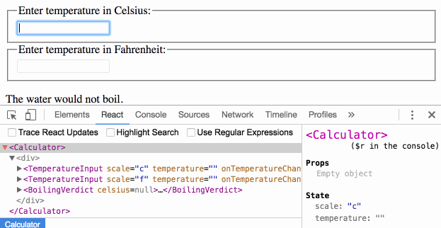

> 此文章是翻译[lifting-state-up](https://facebook.github.io/react/docs/lifting-state-up.html)这篇React（版本v15.5.4）官方文档。

## Lifting State Up

通常，几个组件需要响应相同的数据变化。我们建议提升共享状态（lifting the shared state up）到距离它们最近的父组件。让我们看看这是如何运转的。

在这部分，我们将要创建一个温度计算器来计算给定的温度是否使水沸腾。

我们将创建一个`BoilingVerdict` 组件。它接受一个`celsius` 温度作为props，然后输出是否能够使水沸腾：
```jsx
function BoilingVerdict(props){
  if(props.celsius >= 100){
    return <p>The water would boil.</p>
  }else{
    return <p>The water would nott boil.</p>
  }
}
```

然后，我们会创建一个`Calculator` 组件。它渲染一个`<input>` 接受你的键入的温度（ temperature），并将此值保存在`this.state.temperature` 中。

另外，它会当前输入值渲染`BoilingVerdict`。
```jsx
class Calculator extends Component {
  constructor(props){
    super(props)
    this.state = {
      temperature: ''
    }
    this.handleChagne = this.handleChagne.bind(this)
  }

  handleChagne(event){
    this.setState({
      temperature: event.target.value
    })
  }

  render(){
    const temperature = this.state.temperature
    return (
      <fieldset>
        <legend>Enter temperature in celsius:</legend>
        <input
          value={temperature}
          onChange={this.handleChagne} />
        <BoilingVerdict celsius={parseFloat(temperature)} />
      </fieldset>
    )
  }
}
```
[在CodePen 上尝试](http://codepen.io/valscion/pen/VpZJRZ?editors=0010)

### Adding a Second Input

我们的新需求是，除了Celsius input ，我们还需要提供一个Fahrenheit input，并且让它们保持同步（in sync）。

开始我们可以从`Calculator` 组件中提取一个`TemperatureInput` 组件。我们将添加一个`scale` prop ，只可以接受“c”或“ｆ”：
```jsx
const scaleNames = {
  c: 'Celsius',
  f: 'Fahrenheit'
}

class TemperatureInput extends Component {
  constructor(props){
    super(props)
    this.state = {
       temperature: ''
     }
    this.handleChange = this.handleChange.bind(this)
  }

  handleChange(event){
    this.setState({
      temperature: event.target.value
    })
  }

  render(){
    const temperature = this.state.temperature
    const scale = this.props.scale
    return (
      <fieldset>
        <legend>Enter temperature in {scaleNames[scale]}</legend>
        <input
          value={temperature}
          onChange={this.handleChange} />
      </fieldset>
    )
  }
}
```
现在我们可以修改`Calculator` 去渲染两个不同的temperature inputs：
```jsx
class Calculator extends Component {
  render(){
    return (
      <div>
        <TemperatureInput scale="c" />
        <TemperatureInput scale="f" />
      </div>
    )
  }
}
```
[在CodePen 上尝试](http://codepen.io/valscion/pen/GWKbao?editors=0010)

现在我们有两个input，但是当你在其中一个键入temperature时，另一个不会更新。这同我们的需求相反：我们想要它们保持同步（in sync）。

我们也不能在`Calculator` 中展示`BoilingVerdict`。这个`Calculator` 不知道当前的temperature 因为它被隐藏在`TemperatureInput` 中。

### Writing Conversion Functions
首先，我们要写两个函数来互相转换`Celsisus` 和 `Fahrenheit`。
```jsx
function toCelsius(fahrenheit){
  return (fahrenheit - 32 ) * 5 / 9
}

function toFahrenheit(celsius){
  return (celsius * 9 / 5) + 32
}
```
这两个函数转换数值。我们还要写另一个函数，它接受一个string 类型的`value`和一个转换函数作为参数并且返回一个string。我们调用此函数来通过一个输入值获取另一个输入值。

如果是一个无效的`value` 它将返回一个空字符串，并且输出值保留三位小数。
```jsx
function tryCovert(value, convert){
  const input = parseFloat(value)
  if(Number.isNaN(input)){
    return ''
  }
  const output = convert(input)
  const rounded = Math.round(output * 1000) / 1000
  return rounded.toString()
}
```
例如，`tryConvert('abc', toCelsisu)` 将返回一个空字符串，而`tryConvert('10.22', toFahrenheit)` 将返回`50.369`。

### Lifting State Up

当前，两个`TemperatureInput` 组件各自独立保存它们的值在本地state 中：
```jsx
class TemperatureInput extends React.Component {
  constructor(props) {
    super(props)
    this.handleChange = this.handleChange.bind(this)
    this.state = {temperature: ''}
  }

  handleChange(e) {
    this.setState({temperature: e.target.value})
  }

  render() {
    const temperature = this.state.temperature
  }
}
```
但是，我们希望这两个输入是相互同步的。 当我们更新Celsisus input时，Fahrenheit input 应反映转换温度，反之亦然。

在React中，共享状态是通过将其移动到需要它的组件的最接近的共同祖先来实现的。 这被称为“提升状态（lifting state up）”。 我们将从`TemperatureInput` 中删除本地状态，并将其移动到`Calculator` 中。

如果`Calculator` 拥有共享状态，则它将成为两个输入中当前温度的“真实来源（source of truth）”。 它可以指示他们具有彼此一致的值。 由于两个`TemperatureInput` 组件的props来自同一个父`Calculator` 组件，所以两个输入将始终保持同步。

让我们看看这是如何一步一步工作的。

首先，我们将在`TemperatureInput` 组件中用`this.props.temperature` 替换`this.state.temperature`。 现在，假设`this.props.temperature` 已经存在，虽然我们将来需要从`Calculator` 传递它：
```jsx
render() {
  // Before: const temperature =  this.state.temperature
  const temperature = this.props.temperature
}
```
我们知道[props 是只读的](https://facebook.github.io/react/docs/components-and-props.html#props-are-read-only)。当`temperature` 处于本地state 时，`TemperatureInput` 可以调用`this.setState()` 来更改它。 然而，现在`temperature` 作为prop来自父组件，`TemperatureInput` 无法控制它。

在React中，通常通过使组件“受控（controlled）”来解决。 就像DOM `<input>`一样，同时接受一个`value` 和一个`onChange` prop，所以自定义的`TemperatureInput` 也可以接受来自其父`Calculator` 的`temperature` 和`onTemperatureChange` props。

现在，当`TemperatureInput`想要更新其temperature 时，它会调用`this.props.onTemperatureChange`：
```jsx
handleChange(e) {
  // Before: this.setState({temperature: e.target.value})
  this.props.onTemperatureChange(e.target.value)
}
```
请注意，自定义组件中的`temperature`或`onTemperatureChange` prop名称没有特殊的含义。 我们可以叫他们任何其他的东西，像命名他们为`value`和`onChange`这是一个常见的惯例。

`onTemperatureChange` prop将与父`Calculator` 组件的`temperature` prop一起提供。 它将通过修改自己的本地state来处理change，从而将两个输入重新提供给新值。 我们将很快看到新的`Calculator` 实现。

在`Calculator` 中进行更改之前，让我们回顾一下对`TemperatureInput` 组件的更改。 我们已经从中删除了本地state，而不是读取`this.state.temperature`，我们现在读取`this.props.temperature`。 我们现在调用`this.props.onTemperatureChange()`，而不是调用`this.setState()` ，这将由`Calculator` 提供：
```jsx
class TemperatureInput extends React.Component {
  constructor(props){
    super(props)
    this.handleChange = this.handleChange.bind(this)
  }

  handleChange(e){
    this.props.onTemperatureChange(e.target.value)
  }

  render(){
    const temperature = this.props.temperature
    const scale = this.props.scale
    return (
      <fieldset>
        <legend>Enter temperature in {scaleNames[scale]}</legend>
        <input
          value={temperature}
          onChange={this.handleChange} />
      </fieldset>
    )
  }
}
```
现在我们来看一下`Calculator` 组件。

我们将当前输入的`temperature` 和`scale`存储在本地state。 这是我们从inputs中“提升（lifted up）”的state，它们将作为他们两个的“真理之源（source of truth）”。 为了呈现两个输入，我们需要知道的所有数据的最小表示。

例如，如果我们在摄氏度输入中输入37，则`Calculator` 组件的state将是：
```jsx
{
  temperature: '37',
  scale: 'c'
}
```
如果我们稍后将Fahrenheit 字段编辑为212，则`Calculator`的state将为：
```jsx
{
  temperature: '212',
  scale: 'f'
}
```
我们可以存储两个inputs 的值，但实际上是不必要的。 存储最近更改的input 的值以及它所代表的scale 就足够了。 然后，我们可以基于当前的`temperature` 和`scale` 来推断另一个input 的值。

inputs 保持同步，因为它们的值是从相同state计算的：

```jsx
class Calculator extends Component {
  constructor(props){
    super(props)
    this.handleCelsiusChange = this.handleCelsiusChange.bind(this)
    this.handleFahrenheitChange = this.handleFahrenheitChange.bind(this)
    this.state = {
      temperature: '',
      scale: 'c'
    }
  }

  handleCelsiusChange(temperature){
    this.setState({
      scale: 'c',
      temperature
    })
  }

  handleFahrenheitChange(temperature){
    this.setState({
      scale: 'f',
      temperature
    })
  }

  render(){
    const scale = this.state.scale
    const temperature = this.state.temperature
    const celsius = scale === 'f' ? tryCovert(temperature, toCelsius) : temperature
    const fahrenheit = scale === 'c' ? tryCovert(temperature, toFahrenheit) : temperature
    return (
      <div>
        <TemperatureInput
          scale="c"
          temperature={celsius}
          onTemperatureChange={this.handleCelsiusChange}/>
        <TemperatureInput
          scale="f"
          temperature={fahrenheit}
          onTemperatureChange={this.handleFahrenheitChange}/>
        <BoilingVerdict
          celsisu={parseFloat(celsisu)} />
      </div>
    )
  }
}
```
[在CodePen 上尝试](http://codepen.io/valscion/pen/jBNjja?editors=0010)


现在，无论是你在那一个input 进行编辑，在`Calculator` 中`this.state.temperature` 和`this.state.scale` 都会更新。其中的一个input 获取value，任何input 都会被保存，另一个input 都会基于这个值来更新。

让我们回顾一下编辑input时会发生什么：

* React调用在DOM `<input>`上指定为`onChange` 的函数。在我们的例子中，这是`TemperatureInput` 组件中的`handleChange` 方法。
* `TemperatureInput` 组件中的`handleChange` 方法使用新的所需值调用`this.props.onTemperatureChange()`。其props 包括`onTemperatureChange`，由其父组件`Calculator`提供。
* 当它渲染之前，`Calculator`已经指定了Celsius `TemperatureInput` 的`onTemperatureChange` 是`Calculator` 的`handleCelsiusChange` 方法，而Fahrenheit `TemperatureInput` 的`onTemperatureChange` 是`Calculator` 的`handleFahrenheitChange` 方法。因此，根据我们编辑的input，调用这两个`Calculator`方法。
* 在这些方法中，`Calculator` 组件要求React通过使用新的input 值和刚刚编辑的input的当前scale 调用`this.setState()` 来重新渲染自身。
* React调用`Calculator` 组件的`render` 方法来了解UI的外观。基于当前temperature和有效scale重新计算两个inputs的值。这里进行温度转换。
* React使用`Calculator`指定的新props调用各个`TemperatureInput` 组件的渲染方法。它会了解UI的外观。
* React DOM更新DOM以匹配所需的输入值。我们刚刚编辑的input 接收其当前值，另一个input 更新为转换后的temperature。

每个更新都会执行相同的步骤，以便输入保持同步。

### Lessions Learned

在React 应用中任何数据变动都应该是基于一个"source of truth"。通常state 被首先加入组件去渲染。然后，如果另一个组件也需要它，那么你就可以将它们提升到它们的父组件中。而不是尝试在不同的组件中同步state，你应该依赖[top-down data flow](https://facebook.github.io/react/docs/state-and-lifecycle.html#the-data-flows-down)。

通过专注写模版代码（boilerplater）而不是进行双向绑定，但是有一个优点，它能花费很少工作去发现和隔离bug。因为任何state 都“存在（lives）”于组件而组件可以独立改变state，确定bug 的范围也会减少。除此之外，你可以实现自定义逻辑去拒绝或改变用户输入。

如果有些东西可以来自props 或者state ，那么它就不应该存在与state 中。例如，我们存储`temperature` 和`scale` 而不是存储`celsiusValue` 和`fahrenheitValue`。另一个input 值总是可以在`render()` 方法中被计算得到。这可以让我们清晰的 应用在任何取值范围而不会失去用户输入精度。

如果在UI 中有错误，你可以使用[React Developer Tools](https://github.com/facebook/react-devtools) 对props 进行检测，并将其移动到树上，知道找到负责更新的组件为止。这可以让你从源代码上跟踪bug。

