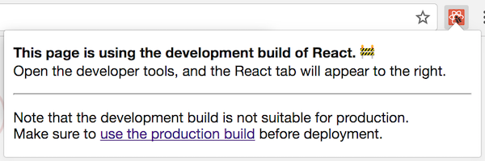
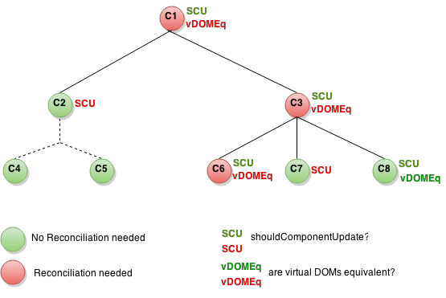

> 此文章是翻译[Optimizing Performance](https://reactjs.org/docs/optimizing-performance.html)这篇React（版本v16.2.0）官方文档。

## Optimizing Performance

在内部，React 使用一些聪明的技术去减少更新UI 操作所需要花费的昂贵的DOM 操作数量。对于许多应用，使用React 产生一个快速的用户界面而不需要做大量的专门优化性能的操作。不过，这里仍有几种方式去加速你的应用。

### Use the Production Build

如果你正在你的React apps 中检测或测试性能问题，请确保你使用最小生产环境（minified production）构建测试。

默认情况下，React 包括很多有用的警告。这些警告在开发时是非常有用的。然而，他们会使React 体积变大速度变慢，所以你应该确保在部署应用的时候应该使用生产版本。

如果你不确认你的构建过程设置是否正确，你可以通过安装[React Developer Tools for Chrome](https://chrome.google.com/webstore/detail/react-developer-tools/fmkadmapgofadopljbjfkapdkoienihi)来检测它。如果你在生产模式下访问一个React 站点，icon 会变成黑色的背景：


如果你在开发模式下访问一个React 站点，icon 会变成红色：


期待在你的应用程序工作时使用开发模式，以及在部署应用程序到用户时使用生产模式。

你可以在下面找到构建你的生产环境应用程序的说明。

### Create React App

如果你的项目使用[Create React App](https://github.com/facebookincubator/create-react-app)构建，运行：

```
npm run build
```

这将在你的项目的`build/`文件夹中创建应用程序的生产构建。

请记住，只有在部署到生产之前才需要这样做。 对于正常开发，请使用`npm start`。

### Single-File Builds

我们提供生产准备（production-ready）版本的React 和React DOM 作为单个文件：

```
<script src="https://unpkg.com/react@16/umd/react.production.min.js"></script>
<script src="https://unpkg.com/react-dom@16/umd/react-dom.production.min.js"></script>
```

请记住，只有以`.production.min.js` 结尾的React 文件适合生产。

### Bunch

为了最有效的Brunch 生产构建，安装[uglify-js-brunch](https://github.com/brunch/uglify-js-brunch)插件：

```
# If you use npm
npm install --save-dev uglify-js-brunch

# If you use Yarn
yarn add --dev uglify-js-brunch
```

然后，生成一个生产构建，添加`-p` 标志在`build` 命令中：

```
brunch build -p
```

记住，你只需要为生产构建做到这些。 你不应该在开发中传递`-p` 标志或应用此插件，因为它会隐藏有用的React 警告，并使构建速度变得更慢。

### Browserify

为了最有效的Browserify 生产构建，安装几个插件：

```
# If you use npm
npm install --save-dev envify uglify-js uglifyify

# If you use Yarn
yarn add --dev envify uglify-js uglifyify
```

要创建生产构建，请确保添加这些转换 **（顺序很重要）**：

* [envify](https://github.com/hughsk/envify) 转换确保正确的构建环境设置。 使其成为全局（`-g`）。
* [uglifyify](https://github.com/hughsk/uglifyify) 转换可以删除开发引入。 也使其成为全局（`-g`）。
* 最后，所得到的bundle被管道传输到[uglify-js](https://github.com/mishoo/UglifyJS2) 以进行修改（[阅读了解为什么](https://github.com/hughsk/uglifyify#motivationusage)）。

例如：

```
browserify ./index.js \
  -g [ envify --NODE_ENV production ] \
  -g uglifyify \
  | uglifyjs --compress --mangle > ./bundle.js
```

> 注意：

> 包名是`uglify-js`，但是二进制文件称为`uglifyjs`。这不是一个手误。

记住，你只需要为生产构建做到这些。 你不应该在开发中应用这些插件，因为它会隐藏有用的React 警告，并使构建速度变得更慢。

### Rollup

为了最有效的Rollup生产构建，安装几个插件：

```
# If you use npm
npm install --save-dev rollup-plugin-commonjs rollup-plugin-replace rollup-plugin-uglify

# If you use Yarn
yarn add --dev rollup-plugin-commonjs rollup-plugin-replace rollup-plugin-uglify
```

要创建生产构建，请确保添加这些转换 **（顺序很重要）**：

* [replace](https://github.com/rollup/rollup-plugin-replace) 插件确保正确的构建环境设置。
* [commonjs](https://github.com/rollup/rollup-plugin-commonjs) 插件为Rollup中的CommonJS 提供支持。
* [uglify](https://github.com/TrySound/rollup-plugin-uglify) 插件可以压缩和更改最终包。

```
plugins: [
  // ...
  require('rollup-plugin-replace')({
    'processs.env.NODE_ENV': JSON.stringify('production')
  }),
  require('rollup-plugin-commonjs')(),
  require('rollup-plugin-uglify')(),
  // ...
]
```

完整的设置例子[看这个gist](https://gist.github.com/Rich-Harris/cb14f4bc0670c47d00d191565be36bf0)。

记住，你只需要为生产构建做到这些。 你不应该在开发中应用`uglify` 插件或在`replace` 插件上使用`'production'` 值，因为它会隐藏有用的React 警告，并使构建速度变得更慢。

### Webpack

> 注意：

> 如果使用Create React App，请按照[上面的介绍](https://reactjs.org/docs/optimizing-performance.html#create-react-app)

> 这部分只是和你直接配置Webpack 相关。

为了最有效的Webpack 生产构建，确保在你的生产配置中安装这些插件：

```
new webpack.DefinePlugin({
  'process.env.NODE_ENV':  JSON.stringify('production')
}),
new webpack.optimize.UglifyJsPlugin()
```

你可以在[Webpack documentation](https://webpack.js.org/guides/production-build/) 了解更多。

记住，你只需要为生产构建做到这些。 你不应该在开发中应用`UglifyJsPlugin` 插件或在`DefinePlugin` 插件上使用`'production'` 值，因为它会隐藏有用的React 警告，并使构建速度变得更慢。

### Profiling Components with Chrome Timeline

在 **开发** 模式，你可以在支持使用性能工具的浏览器中来可视化组件如何安装，更新和卸载。 例如：


要在Chrome中执行此操作：

1. 确保你给正在开发模式下运行应用。
2. 打开Chrome DevTools [Performance](https://developers.google.com/web/tools/chrome-devtools/evaluate-performance/timeline-tool) 选项卡，然后按 **Record**。
3. 执行你要分析的操作。 不要记录超过20秒钟否则Chrome可能挂起。
4. 停止记录。
5. React 事件将分组在 **User Timing** 标签下。

更多详细的指导，查看[this article by Ben Schwarz](https://building.calibreapp.com/debugging-react-performance-with-react-16-and-chrome-devtools-c90698a522ad)。

注意，**数字是相对的，所以组件将在生产中呈现更快的速度**。 然而，这应该可以帮助你意识到无关的UI 被错误地更新，以及你的UI 更新发生的深度和频率。

目前，Chrome，Edge和IE是唯一支持此功能的浏览器，但是我们使用标准的[User Timing API](https://developer.mozilla.org/en-US/docs/Web/API/User_Timing_API)，因此我们希望更多的浏览器可以为其添加支持。

### Virtualize Long Lists

如果你的应用程序渲染很长的数据列表（数百或数千行），我们推荐使用称为“windowing” 的技术。此技术仅在任何给定时间渲染行数据的一小部分，并且可以显著减少重新渲染组件所花费的时间以及所创建的DOM节点的数量。

[React Virtualized](https://bvaughn.github.io/react-virtualized/) 是一个流行的windowing 库。它提供了几个可重复使用的组件，用于显示列表、网格和表格数据。你还可以创建自己的windowing 组件，如[Twitter did](https://medium.com/@paularmstrong/twitter-lite-and-high-performance-react-progressive-web-apps-at-scale-d28a00e780a3)，如果你希望更适合你的应用程序的特定的使用情形。

### Avoid Reconciliation

React 构建和维护了一个内部的渲染UI 的展现。它包括在组件中返回的React 元素。这种表现会让React 避免创建DOM 节点以及访问除必要之外的已经存在的节点，这会使得比在JavaScript 对象上的操作慢。有时它引用一个虚拟DOM（virtual DOM），但是它的工作方式和React Native 一致。

当一个组件的props 或state 反生改变，React 通过对比最新返回的元素同之前已经渲染的元素进行对比来决定是否更新一个真实的DOM。当它们不相等，React 将会更新这个DOM。

在一些情况下，你的组件会加速这一切，通过重写生命周期函数`shouldComponentUpdate`，此函数在重新渲染过程开始之前触发。这个函数的默认实现是返回`true`,这让React 去执行这个更新：

```
shouldComponentUpdate(nextProps, nextState) {
  return true;
}
```

如果你知道在某些情况下你的组件不需要更新，你可以通过在`shouldComponentUpdate` 中返回`false` 来跳过整个更新进程，包括调用组件上的`render()` 方法和之后方法。

### shouldComponentUpdate In Action

这有一个组件的子树。对于每一个节点，`SCU` 表示`shouldComponentUpdate` 返回值，`vDOMEq` 表示这个已渲染的React 元素是否等价。最后，这个圆圈的颜色表示这个组件是否已经使被reconciled 或没有。



由于`shouldComponentUpdate` 返回`false` 在子树的C2 处，React 不必渲染C2，也就不需要在C4 和C5 处调用`shouldComponentUpdate`。

在C1 和C3 处，`shouldComponentUpdate` 返回`true`，所以React 继续向下到叶子节点并检测它们。在C6 处，`shouldComponentUpdate` 返回`true`，由于和已经渲染的element 不想等所以React 必须更新DOM。

最有趣的案例是C8。React 必须去渲染这个组件，但是由于它返回的React 元素同之前的已经渲染的element 相等，所以它不必去更新这个DOM。

注意，React 必须为C6 做DOM 改变，这是不可避免的。在C8 处，和已经渲染的React 元素摆脱了困境，对于C2 的子树和C7，它甚至不需要比较我们已经接受了`shouldComponentUpdate` 的elements，这个`render` 也不需要调用。

### Examples

如果你的组件改变的方式是，当`props.color` 或者`state.count` 变量改变时，你应该通过这个`shouldComponentUpdate` 去检测：

```
class CounterButton extends React.Component {
  constructor(props) {
    super(props);
    this.state = {count: 1};
  }

  shouldComponentUpdate(nextProps, nextState) {
    if (this.props.color !== nextProps.color) {
      return true;
    }
    if (this.state.count !== nextState.count) {
      return true;
    }
    return false;
  }

  render() {
    return (
      <button
        color={this.props.color}
        onClick={() => this.setState(state => ({count: state.count + 1}))}>
        Count: {this.state.count}
      </button>
    );
  }
}
```

在上面代码中，`shouldComponentUpdate` 只是检测`props.color` 或者`state.count` 是否有任何改变。如果这些值没有改变，那么这个组件不需要更新。如果你的组件变得更复杂了，你需要使用一种类似的方法"shallow comparison" 在`props` 和`state` 域中去决定这个组件是否应该更新。这个方式是足够通用的并且React 提供了一个helper 去使用这个逻辑-只需要继承`React.PureComponent`。所以下面的代码去实现相同的功能是非常简单的：

```
class CounterButton extends React.PureComponent {
  constructor(props) {
    super(props);
    this.state = {count: 1};
  }

  render() {
    return (
      <button
        color={this.props.color}
        onClick={() => this.setState(state => ({count: state.count + 1}))}>
        Count: {this.state.count}
      </button>
    );
  }
}
```

大多数时间，你可以使用`React.PureComponent` 去替代你写`shouldComponentUpdate`。它只能做一个浅比较（shallow comparison），所以你不能使用它，当props 和state 在发生突变时，由于浅比较会错过。

对于更加复杂的数据结构这是一个问题。例如，我们说你想要`ListOfWords` 组件去渲染一个分号分割（comma-separated ）的单词列表，它的父`WordAdder`组件让你点击一个按钮去添加一个单词到列表中。下面代码不能正确运行：

```
class ListOfWords extends React.PureComponent {
  render() {
    return <div>{this.props.words.join(',')}</div>
  }
}

class WordAdder extends React.Component {
  constructor(props) {
    super(props);
    this.state = {
      words: ['marklar']
    };
    this.handleClick = this.handleClick.bind(this);
  }

  handleClick() {
    // This section is bad style and causes a bug
    const words = this.state.words;
    words.push('marklar');
    this.setState({words: words});
  }

  render() {
    return (
      <div>
        <button onClick={this.handleClick} />
        <ListOfWords words={this.state.words} />
      </div>
    );
  }
}
```

问题是`PureComponent` 将会做一个简单的对比在`this.props.words` 的旧值和新值之间。由于这块代码在`WorldAddr` 中的`handleClick` 方法中改变了这个`words` 数组，这个`this.props.word` 的旧值和新值是相等的，即使是这个words 已经改变了。这个`ListOfWorlds` 不会更新即使它有了一个新值应该去更新。

### The Power Of Not Mutating DAta

避免这个问题最简单的方法是当你使用props 和state 时不去改变值。例如，上面的例子可以使用`concat` 去重写：

```
  handleClick() {
    this.setState(prevState => ({
      words: prevState.words.concat(['marklar'])
    }));
  }
```

ES6 支持的数组的[spread syntax](https://developer.mozilla.org/en-US/docs/Web/JavaScript/Reference/Operators/Spread_operator) 使其更简单。如果你使用Create React App，它已经默认支持了。

```
  handleClick() {
    this.setState(prevState => ({
      words: [...prevState.words, 'marklar']
    }));
  }
```

按同样的方式，你可以重写这个可改变对象去避免改变。例如，我们说我们有一个`colormap` 的对象，我们写一个函数去改变`colormap.right` 为`blue`。我们可以这样写：

```
function updateColorMap(colormap) {
  colormap.right = 'blue'
}
```

写一个代码如果不改变原始对象，我们可以使用[Object.assign](https://developer.mozilla.org/en-US/docs/Web/JavaScript/Reference/Global_Objects/Object/assign) 方法：

```
function updateColorMap(colormap) {
  return Object.assing({}, colormap, {right: 'blue'})
}
```

`updateColorMap` 现在返回一个新对象而不是改变的就对象。`Object.assign` 是ES6 方法需要使用一个polyfill。

这有一个添加[object spread properties](https://github.com/sebmarkbage/ecmascript-rest-spread)的JavaScript 提案（proposal），使得不需要改变就能简单更新对象：

```
function updateColorMap(colormap) {
  return {...colormap, right: 'blue'}
}
```

如果你使用Create React App，使用`Object.assign` 和`the object spread syntax` 默认是有效的。

### Using Immutable Data Structures

[Immutable.js](https://github.com/facebook/immutable-js) 是另一种解决这个问题的方法。它通过结构共享来提供不可变的、持久的集合来工作：

* Immutable：一旦创建，一个集合在另一个时间点不能被改变。
* Persistent：新集合可以从之前集合和一个可变的set 中创建。当新集合被创建之后原始的集合仍然有效。
* Structral Sharing：创建的新集合尽可能和使用同原始集合一样的结构，减少复制量提升性能。

不变性（immutability）使得追踪改变非常简单。每一个改变总是产生一个新对象所以我们只需要检测这个对象的引用是否改变。例如，下面常规的JavaScript 代码：

```
const x = { foo: 'bar' };
const y = x;
y.foo = 'baz';
x === y; // true
```

虽然y 已经被编辑了，由于它和x 是同一个引用，这个比较返回`true`。你可以使用immutable.js 写类似的代码：

```
const SomeRecord = Immutable.Record({ foo: null });
const x = new SomeRecord({ foo: 'bar' });
const y = x.set('foo', 'baz');
const y = x.set('foo', 'bar');
x === y; // false
x === z; // true
```

在这个例子中，当改变`x` 时返回一个新的引用，我们可以使用引用相等新检查`(x === y)` 去验证存储在`y` 中的新值同存储在`x` 中的新值是不同的。

[seamless-immutable](https://github.com/rtfeldman/seamless-immutable)和[immutability-helper](https://github.com/kolodny/immutability-helper) 这两个库也可以帮助使用不可变数据。

不可变数据结构提供给你一个简单的方式追踪一个对象的改变，在需要我们去实现`shouldComponentUpdate` 时。它可以提供给你一个非常好的性能提升。
