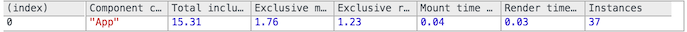

> 此文章是翻译[Performance Tools](https://facebook.github.io/react/docs/perf.html)这篇React（版本v15.4.0）官方文档。

## Performance Tools

**Importing**
```jsx
import Perf from 'react-addons-perf' // ES6
var Perf = require('react-addons-perf') // ES5 with npm
var Perf = React.addons.Perf // ES5 with react-with-addons.js
```

## Overview

React 在沙盒中是非常快的。然而，在你需要压缩你的应用的每一盎司性能，它提供了一个[shouldComponentUpdate()](https://facebook.github.io/react/docs/react-component.html#shouldcomponentupdate) 钩子，你可以添加优化提示到React的比较算法（diff algorithm）。

除了给你一个你的应用整体性能概括，`Perf` 是一个分析工具，准确地告诉你，你需要在哪里添加这些钩子（hooks）。

参考[Benchling Enginering Team](http://benchling.engineering/) 深入介绍性能工具的文章：

* [“Performance Engineering with React”](http://benchling.engineering/performance-engineering-with-react/)
* [“A Deep Dive into React Perf Debugging”](http://benchling.engineering/deep-dive-react-perf-debugging/)


## Development vs. Production Builds

如果你正在检测和查看你的React 应用的性能问题，确保你正在使用[minified production build]() 进行测试。在开发构建中包括额外的警告是有用的当构建你的应用时，但是由于它做的这些额外的簿记（bookkeep）会导致变慢。

然而，perf 工具只是当React 开发构建时在本页的工作。因此，探测器（profiler）只服务于指示你的应用相关部分的花费。

## Using Perf

Perf 只能在React 的开发模式中使用。当构建你应用的生产环境时，不能使用这个插件。

### Getting Measurements


* [start()](https://facebook.github.io/react/docs/perf.html#start)
* [stop()](https://facebook.github.io/react/docs/perf.html#stop)
* [getLastMeasurements()](https://facebook.github.io/react/docs/perf.html#getlastmeasurements)


### Printing Results

下面这些方法使用测量返回通过[Perf.getLastMeasurements]() 去打印漂亮的结果。

* [printInclusive()](https://facebook.github.io/react/docs/perf.html#printinclusive)
* [printExclusive()](https://facebook.github.io/react/docs/perf.html#printexclusive)
* [printWasted()](https://facebook.github.io/react/docs/perf.html#printwasted)
* [printOperations()](https://facebook.github.io/react/docs/perf.html#printoperations)
* [printDOM()](https://facebook.github.io/react/docs/perf.html#printdom)


## Reference

### start()

### stop()

```jsx
Perf.start()
// ...
Perf.stop()
```
开始/停止检测。在两者之间的React 操作被记录用来分析。操作所花费的少量事件被忽略。

停止操作子厚，你需要调用[Perf.getLastMeasurements](https://facebook.github.io/react/docs/perf.html#getlastmeasurements) 去获取测量。

### getLastMeasurements()

```jsx
Perf.getLastMeasurements()
```
从上一个开始-结束会话之间获取用来测量的不透明的数据结构。你可以保存它并传递给[Perf](https://facebook.github.io/react/docs/perf.html#printing-results) 的其它方法用来分析过去的测量。

>**Note：**
不要依赖返回值的要求的格式，因为它可能在次要（minor）版本中发生改变。如果返回值格式成为公共API 支持部分，我们将更新文档。

### printInclusive()

```jsx
Perf.printInclusive(measurements)
```
打印花费的所有时间。如果没有参数传入，默认为上次记录的所有测量值。在console 中打印格式友好的表格，像这样：


### printExclusive()

```jsx
Perf.printExclusive(measurements)
```
“排除（Exclusive）”时间不包括加载components 的时间：处理props，调用`componentWillMount` 和`componentDidMount` 等等。


### printWasted()

```jsx
Perf.printWasted(measurements)
```
**分析器（profiler）中最有用的部分。**
“无用的（Wasted）”时间是花费在component 杀死你没有真正渲染任何事情，例如，渲染保持不变，所以DOM 没有被操作（touched）。


### printOperations()

```jsx
Perf.printOperations(measurements)
```
打印底层DOM 操作，例如，“设置innerHTML” 和“移除节点（remove ）”。


### printDOM()

```jsx
Perf.printDOM(measurements)
```
这个方法已经被重名为[printOperations()]()。目前，`printDOM()` 方法仍然存在作为一个别名，但是它打印一个废弃的警告并且将会真正被移除。
