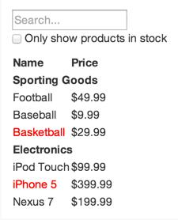
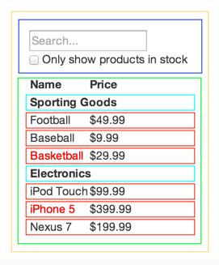

> 此文章是翻译[thingking in react](https://facebook.github.io/react/docs/thingking-in-react.html)这篇React（版本v15.5.4）官方文档。

## Thinking in React

在我们看来，React 是使用JavaScript 构建大型快速Web 应用的首选。它已经在Facebook 和Instagram 中被广泛应用了。

React 最大的方面是使你考虑如果构建你的应用。在这篇文档中，我们将带你浏览通过使用React 构建一个searchable product data的思维过程。

### Start With A Mock

设想你已经根据我们的设计有一个模拟JSON API。这个Mock 看上去如下：



我们的JSON API 返回的数据如下：
```js
[
  {category: "Sporting Goods", price: "$49.99", stocked: true, name: "Football"},
  {category: "Sporting Goods", price: "$9.99", stocked: true, name: "Baseball"},
  {category: "Sporting Goods", price: "$29.99", stocked: false, name: "Basketball"},
  {category: "Electroincs", price: "$99.99", stocked: true, name: "iPod Touch"},
  {category: "Electroincs", price: "$399.99", stocked: false, name: "iPhone 5"},
  {category: "Electroincs", price: "$199.99", stocked: true, name: "Nexus 7"}
]
```

### Step 1: Break The UI Into A Component Hierarchy

第一件事在mock 中给每一个组件（子组件）画框并进行命名。如果你和一个设计师工作，他们已经做好这些了，所以去和他们讨论！Photoshop 层名字可以作为你的React 组件名字！

但是你怎么知道什么是它们自己的组件？只需要使用相同的技术是否决定创建一个新的function 或者object 这个中技术。其中一个技术是[single responsibility principle](https://en.wikipedia.org/wiki/Single_responsibility_principle)，也就是说，理论上一个组件只做一件事。如果组件变大，它应该被拆分成几个小组件。

由于你经常展示一个JSON 数据模型给用户，你会发现如果你的模型被正确构建，那么你的UI（和你的组件框架）会非常好的匹配。那是因为UI 和数据模型总是依附相同的信息架构（information architecture），也就是意味着分离你的UI 成为组件是非常容易的。只要正确地的将你的每一个数据模型对应组件就可以了。



你会发现在我们这个简单的app 中有5 个组件。我们使用斜体数据来表示每一个组件

1. `FiterableProductTable`（orange）：包含整个例子
2. `SearchBar`（blue）：接受所有的用户输入
3. `ProdutTable`（green）：根据用户输入来展示过滤的数据集合
4. `ProductCategoryRow`（turquoise）：展示每一个分类的标头
5. `ProductRow`（red）：每一个产品展示一行

如果你看`ProductTable`，你会发现表格头（包含"Name" 和"Price" 标签）并不是单独一个组件。这是一个重要的表现，并且这里可以使用两种方式作为参数传入。例如，我们将它作为`ProductTable` 的一部分，因为因为它是`ProductTable` 的负责的渲染数据的一部分。无论怎样，如果它的头变复杂了（例如，如果我们添加了一个排序），最好的方式的作为一个单独的`ProductTableHeader`组件。

现在我们已经确认了在模拟中的组件，让我们来安排它们称为一个层次。这是非常容易的。在模拟中，组件可以作为另一个组件的孩子进行展示：
* `FilterableProductTable`
	* `SearchBar`
	* `ProductTable`
		* `ProductCategoryRow`
		* `ProductRow`

### Step 2: Build A Static Version in React

```jsx
class ProductCategoryRow extends Component {
  render(){
    return <tr><th colSpan="2">{this.props.category}</th></tr>
  }
}

class ProductRow extends Component {
  render(){
    var name = this.props.product.stocked ?
      this.props.product.name :
      <span style={{color: 'red'}}>
        {this.props.product.name}
      </span>
    return (
      <tr>
        <td>{name}</td>
        <td>{this.props.product.price}</td>
      </tr>
    )
  }
}

class ProductTable extends Component {
  render(){
    var rows = []
    var lastCategory = null
    this.props.products.forEach(function(product){
      if(product.category !== lastCategory){
        rows.push(<ProductCategoryRow category={product.category} key={product.category} />)
      }
      rows.push(<ProductRow product={product} key={product.name} />)
      lastCategory = product.category
    })
    return (
      <table>
        <thead>
          <tr>
            <th>Name</th>
            <th>Price</th>
          </tr>
        </thead>
        <tbody>{rows}</tbody>
      </table>
    )
  }
}

class SearchBar extends Component {
  render(){
    return (
      <form>
        <input type="text" placeholder="Search..." />
        <p>
          <input type="checkbox" />
          {' '}
          Only show products in stock
        </p>
      </form>
    )
  }
}

class FilterableProductTable extends Component {
  render(){
    return (
      <div>
        <SearchBar />
        <ProductTable products={this.props.products} />
      </div>
    )
  }
}


var PRODUCTS = [
  {category: "Sporting Goods", price: "$49.99", stocked: true, name: "Football"},
  {category: "Sporting Goods", price: "$9.99", stocked: true, name: "Baseball"},
  {category: "Sporting Goods", price: "$29.99", stocked: false, name: "Basketball"},
  {category: "Electroincs", price: "$99.99", stocked: true, name: "iPod Touch"},
  {category: "Electroincs", price: "$399.99", stocked: false, name: "iPhone 5"},
  {category: "Electroincs", price: "$199.99", stocked: true, name: "Nexus 7"}
]

ReactDOM.render(
  <FilterableProductTable products={PRODUCTS}/>,
  document.getElementById('root')
)
```
[在CodePen 上尝试](http://codepen.io/lacker/pen/vXpAgj)

现在你有了自己的组件系统，是时候实现你的app 了。最简单的方式的是个构建一个没有交互的只是将数据渲染成UI。最好解耦这些过程，因为构建一个静态版本需要许多代码不需要思考，添加交互需要更多思考和少量的代码。我们会看到为什么。

为了构建一个静态的app 去渲染你的数据模型（data model），你想要构建组件并复用其他的组件同使用props 去传递数据。props 是从父组件传递给子组件数据的一种方式。如果你了解state 的概念，在构建静态版本时，一点也不需要使用state（don't use state at all）。State 被留作交互时，数据随着时间而变动。因为是静态版本，所以你不需要state。

在构建时你可以自上而下（top-down）或自下而上（down-top）。也就是，你可以从位于高层级的组件（例如，`FilterableProductTable`）或者是低层级的组件（`ProductRow`）开始。在简单的例子中，通常是自上而下（top-down），而在大型项目中，通常是从下而上（down-top）这样便于编写测试用例。

在此最后，你有了许多可复用的组件来渲染你的数据模型。因为是静态版本的应用，所以这些组件中仅有`render()` 方法。在顶层组件（`FilterableProductTable`）将会接受你的数据模型作为prop。如果你改变你的基础数据模型（underlying data model）并且又调用了`ReactDOM
.render()`，这个UI 将会被更新。这是很容易看淡你的UI 是如何更新，并在哪里做出改变，因为没有什么复杂的事情。React 是**单向数据流one-way data flow**（也叫做单向绑定one-way bind）来保持一切模块化和快速。

如果你在执行这一步的时候需要帮助，可以简单浏览[React doc](https://facebook.github.io/react/docs/)。

#### A Brief Interlude: Props vs State

在React 中有props 和state 这两种模型数据。了解它们的不同是非常重要的；如果你像了解它们的不同，可以浏览[the offical React docs](https://facebook.github.io/react/docs/state-and-lifecycle.html)

### Step 3: Identify The Minimal（but complete）Representation Of UI State

为了能够使的UI 进行交互，你需要能够触发你的基础数据模型的改变。

为了正确的构建你的app，你需要考虑你的app 需要的最小的稳定的state 的集合。这个的关键是DRY：Don't Repeat Yourself。找出你的应用需要的绝对最小的state，你需要依赖它计算出其它所有的数据。例如，如果你正在构建TODO list，你需要有一个TODO items 数组；不需要为计数而保留一个单独的state变量，当你想要渲染这个TODO 的数量，只需要使用TODO items 数组的长度就可以了。

考虑我们在实例应用程序中所有的数据块。我们有：

* 最初的产品列表（`The original list of products`）
* 用户键入的搜索文本（`The search text the user has entered`）
* checkbox 的值（`The value of the checkbox`）
* 产品过滤列表（`The filtered list of products`）


让我们通过每一个数组块来找到state。简单地问每一个数据块的三个问题：

1. 它是父组件通过props 传递的吗？如果是，它很可能不是state。
2. 它随着时间不改变吗？如果是，它很可能不是state。
3. 在组件中，你能够基于其他的state 或props 来计算出它吗？如果是，它不是state。


`The original list of products`是通过props 进行传递的，所以它不是state 。` The search text and the checkbox ` 似乎是state 因为它们随着时间而改变，并且不能通过其它数据来计算获取。最后，`The filtered list of products` 不是state，因为它可以通过结合`the original list of products` 和 `the searche text and value of the checkbox` 计算出来。

所以最终，我们的state 是：

* 用户键入的搜索文本（`The search text the user has entered`）
* checkbox 的值（`The value of the checkbox`）

### Step 4: Identify Where Your State Should Live

```jsx
class ProductCategoryRow extends Component {
  render(){
    return <tr><th colSpan="2">{this.props.category}</th></tr>
  }
}

class ProductRow extends Component {
  render(){
    var name = this.props.product.stocked ?
      this.props.product.name :
      <span style={{color: 'red'}}>
        {this.props.product.name}
      </span>
    return (
      <tr>
        <td>{name}</td>
        <td>{this.props.product.price}</td>
      </tr>
    )
  }
}

class ProductTable extends Component {
  render(){
    var rows = []
    var lastCategory = null
    this.props.products.forEach((product) => {
      if(product.name.indexOf(this.props.filterText) === -1 || (!product.stocked && this.props.inStockOnly)){
        return;
      }
      if(product.category !== lastCategory){
        rows.push(<ProductCategoryRow category={product.category} key={product.category} />)
      }
      rows.push(<ProductRow product={product} key={product.name} />)
      lastCategory = product.category
    })
    return (
      <table>
        <thead>
          <tr>
            <th>Name</th>
            <th>Price</th>
          </tr>
        </thead>
        <tbody>{rows}</tbody>
      </table>
    )
  }
}

class SearchBar extends Component {
  render(){
    return (
      <form>
        <input type="text" placeholder="Search..." value={this.props.filterText} />
        <p>
          <input type="checkbox" checked={this.props.inStockOnly}/>
          {' '}
          Only show products in stock
        </p>
      </form>
    )
  }
}

class FilterableProductTable extends Component {
  constructor(props){
    super(props)
    this.state = {
      filterText: '',
      inStockOnly: false
    }
  }
  render(){
    return (
      <div>
        <SearchBar
          filterText={this.state.filterText}
          inStockOnly={this.state.inStockOnly}
        />
        <ProductTable
          products={this.props.products}
          filterText={this.state.filterText}
          inStockOnly={this.state.inStockOnly}
        />
      </div>
    )
  }
}


var PRODUCTS = [
  {category: "Sporting Goods", price: "$49.99", stocked: true, name: "Football"},
  {category: "Sporting Goods", price: "$9.99", stocked: true, name: "Baseball"},
  {category: "Sporting Goods", price: "$29.99", stocked: false, name: "Basketball"},
  {category: "Electroincs", price: "$99.99", stocked: true, name: "iPod Touch"},
  {category: "Electroincs", price: "$399.99", stocked: false, name: "iPhone 5"},
  {category: "Electroincs", price: "$199.99", stocked: true, name: "Nexus 7"}
]

ReactDOM.render(
  <FilterableProductTable products={PRODUCTS}/>,
  document.getElementById('root')
)
```
[在CodePen 上尝试](http://codepen.io/lacker/pen/ORzEkG)

OK，现在我们已经确认了app state 的最小集合。Next，我们需要确认一个组件改变或拥有这个state。

记住：React 在组件层级中是单向的向下的数据流。它可能并不立即清楚那一个组件应该拥有什么state。这个通常对新手去了解是充满挑战的，所以根据接下来的步骤来搞清楚它：

对于你应用中的每一个state ：

* 确认每一个组件基于那个state 来进行渲染
* 找到一个共同的所有者组件（一个单独的组件在所有的需要state的层级中）
* 要么是这个共同的拥有者，要么是在这个公共拥有者之上的组件拥有这个state
* 如果你不能找到拥有这个state 的组件，可以简单的创建一个组件来拥有这个state 并将其添加到需要这个state 的所有组件的层级之上

让我们在我们的应用中应用这个策略：
* `ProductTable` 需要这个state 去过滤产品列表（product list），并且`SearchBar` 需要去展示搜索文字（search text）和选中状态（checked）state
* 这个通用的拥有组件是`FilterableProductTable`
* 在概念上来说是有道理的，这个filter text 和checked value 位于`FilterableProductTable` 组件中


Cool，所以我们决定我们的state 位于`FilterableProductTable `。首先在`FilterableProductTable ` 的`construct` 中添加实例属性`this.state = {filterText: '',inStockOnly: false}` 中去初始化应用的state。然后，将`filterText`和`inStockOnly`作为prop 传递给`SearchBar`和`ProductTable`。最后，使用这些props 过滤`ProductTable` 中的row 以及在`SearchBar` 中设置form fields 的值。

你可以看你的应用的行为：设置`filterText` 为`ball` 并刷新你的应用，你会看到table 中数据正确更新了。

### Step 5: Add Inverse Data Flow

```jsx
class ProductCategoryRow extends Component {
  render(){
    return <tr><th colSpan="2">{this.props.category}</th></tr>
  }
}

class ProductRow extends Component {
  render(){
    var name = this.props.product.stocked ?
      this.props.product.name :
      <span style={{color: 'red'}}>
        {this.props.product.name}
      </span>
    return (
      <tr>
        <td>{name}</td>
        <td>{this.props.product.price}</td>
      </tr>
    )
  }
}

class ProductTable extends Component {
  render(){
    var rows = []
    var lastCategory = null
    this.props.products.forEach((product) => {
      if(product.name.indexOf(this.props.filterText) === -1 || (!product.stocked && this.props.inStockOnly)){
        return;
      }
      if(product.category !== lastCategory){
        rows.push(<ProductCategoryRow category={product.category} key={product.category} />)
      }
      rows.push(<ProductRow product={product} key={product.name} />)
      lastCategory = product.category
    })
    return (
      <table>
        <thead>
          <tr>
            <th>Name</th>
            <th>Price</th>
          </tr>
        </thead>
        <tbody>{rows}</tbody>
      </table>
    )
  }
}

class SearchBar extends Component {
  constructor(props){
    super(props)
    this.handleChange = this.handleChange.bind(this)
  }

  handleChange(){
    this.props.onUserInput(this.filterTextInput.value,this.inStockOnlyInput.checked)
  }

  render(){
    return (
      <form>
        <input
          type="text"
          placeholder="Search..."
          value={this.props.filterText}
          ref={(input) => this.filterTextInput = input}
          onChange={this.handleChange} />
        <p>
          <input
            type="checkbox"
            checked={this.props.inStockOnly}
            ref={(input) => this.inStockOnlyInput = input}
            onChange={this.handleChange}/>
          {' '}
          Only show products in stock
        </p>
      </form>
    )
  }
}

class FilterableProductTable extends Component {
  constructor(props){
    super(props)
    this.state = {
      filterText: '',
      inStockOnly: false
    }
    this.handleUserInput = this.handleUserInput.bind(this)
  }

  handleUserInput(filterText, inStockOnly){
    this.setState({
      filterText: filterText,
      inStockOnly: inStockOnly
    })
  }

  render(){
    return (
      <div>
        <SearchBar
          filterText={this.state.filterText}
          inStockOnly={this.state.inStockOnly}
          onUserInput={this.handleUserInput}
        />
        <ProductTable
          products={this.props.products}
          filterText={this.state.filterText}
          inStockOnly={this.state.inStockOnly}
        />
      </div>
    )
  }
}


var PRODUCTS = [
  {category: "Sporting Goods", price: "$49.99", stocked: true, name: "Football"},
  {category: "Sporting Goods", price: "$9.99", stocked: true, name: "Baseball"},
  {category: "Sporting Goods", price: "$29.99", stocked: false, name: "Basketball"},
  {category: "Electroincs", price: "$99.99", stocked: true, name: "iPod Touch"},
  {category: "Electroincs", price: "$399.99", stocked: false, name: "iPhone 5"},
  {category: "Electroincs", price: "$199.99", stocked: true, name: "Nexus 7"}
]

ReactDOM.render(
  <FilterableProductTable products={PRODUCTS}/>,
  document.getElementById('root')
)
```
[在CodePen 上尝试](http://codepen.io/rohan10/pen/qRqmjd)

到现在为止，我们已经建立了一个应用程序，进行正确渲染将props 和state 作为功能在层级中向下流动。现在，是时候添加支持数据从另一个方法流动：在层级中最深出的form 组件去更新位于`FilterableProductTable` 中的state。

Reack 为了使数据流明确，使它能够容易的了解你的程序是如何工作的，但是它需要更多的数据相比传统的双线数据绑定（two-way data binding）

如果在这个例子版本中进行键入信息或操作多选框，你会发现React 忽略了你的输入。这是趋势，通过设置`input` 的`value` 等于在`FiterableProductTable` 中的`state`。

让我们考虑一下接下来会发生什么。我们要确认无论我们如何改变form，我们更新state 去响应用户的输入。因为组件仅能更新它们自己的state，`FilterableProductTable` 去传入一个回调函数到`SearchBar` 其启动无论什么时候state 应该被更新。我们使用`onChange` 事件去通知它。并且在`FilterableProductTable` 中的回调函数中嗲用`setState()` ，去更新应用。

虽然听上去听复杂，实际上只是几行代码。明确你的数据如果在应用中流转。

### And That's It

希望，他能够给你一个思路，在React 中如何思考构建组件和应用。虽然它可能比你之前使用更多的代码，记住代码可读性远超过它的编写，它是非常容易阅读这个模块化，明确的代码。当你开始构建大量的组件库，你会欣赏这个明确的、模块化的，同时使用代码复用，你的代码行数将开始收缩。:)
